import {
    WordTitle,
    SectionTitle,
    BlueTitle,
    ArticleEnding
} from '../../components/CommonComponents'

import TreeExplain from "./components/TreeExplain";
import HashExplain from "./components/HashExplain";

<SectionTitle slug='Overview'>0</SectionTitle>

## 概述

---

<WordTitle type='define'> 树 </WordTitle>

**树**是一种非线性数据结构。树结构的基本单位是节点。节点之间的链接，称为分支 branch 。节点与分支形成树状，结构的开端，称为根 root，或根结点。根节点之外的节点，称为子节点 child。没有链接到其他子节点的节点，称为叶节点 leaf。

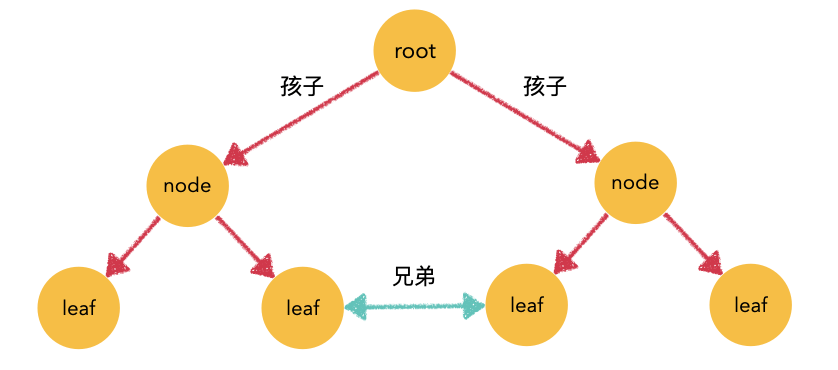

**树**不仅是基本的数据结构，也是理解递归的重要工具。以菲波那切数列为例子，递归过程可以绘制为下图，动画过程可以使用[这网站](https://recursion.now.sh/)查看。

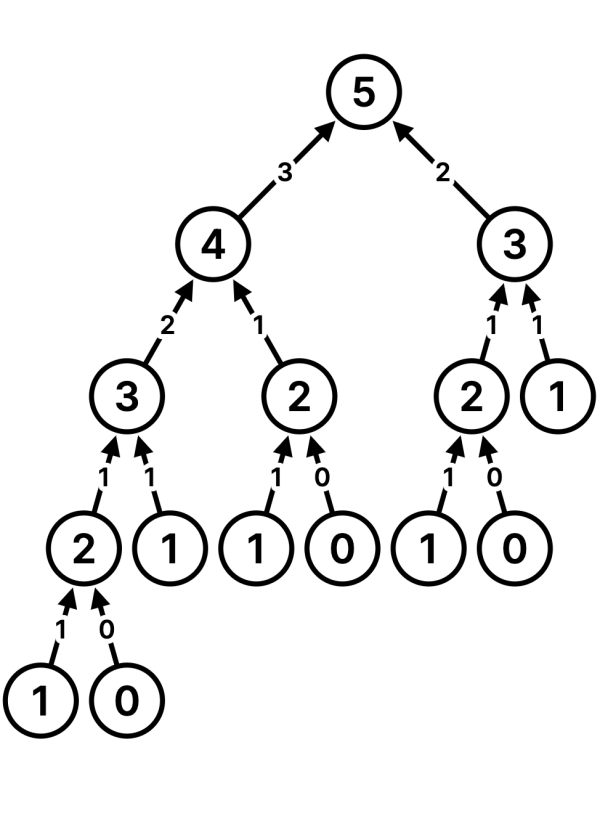

<WordTitle type='define'> 哈希表 | Hash Table </WordTitle>

**哈希表**是根据关键码值(Key value)而直接进行访问的数据结构。优势在于查找的时间复杂度为 `O(1)` ，**用于快速判断一个元素是否出现**。在哈希表构建的时候，存在**哈希碰撞**的问题，不过不是本篇的重点。

**哈希表**常用的数据结构有：**数组 set map**三种。数组不必多说，本篇主要讲解后两者。

<WordTitle type='define'> 集合 | Set </WordTitle>

是使用数字索引，但是最大的特征是**不重复**，可以用于**数据的去重**。

<WordTitle type='define'> 映射 | Map  </WordTitle>

**映射 map**是一种键值对结构，有键 `key` 作为索引，查询值 `value` 数据。


<SectionTitle slug='Binary Tree'>1</SectionTitle>

## 二叉树

---

### 二叉树类型

<WordTitle type='define'> 二叉树 | Binary Tree </WordTitle>

**二叉树 Binary tree**是树形结构的一个重要类型。二叉树的特点是每个节点最多只有两棵子树，即**左子树**和**右子树**。其代码定义是：

```javascript
function TreeNode(val, left, right) {
	this.val = (val===undefined ? 0 : val)
	this.left = (left===undefined ? null : left)
	this.right = (right===undefined ? null : right)
}
```

### 二叉树分类

<WordTitle type='define'> 满二叉树 </WordTitle>

如果一棵二叉树只有度为0的结点和度为2的结点，并且度为0的结点在同一层上，则这棵二叉树为满二叉树。

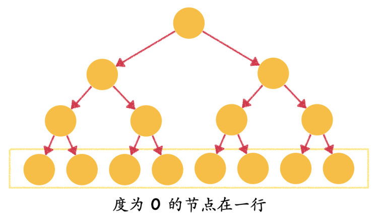

<WordTitle type='define'> 完全二叉树 </WordTitle>

在完全二叉树中，除了最底层节点可能没填满外，其余每层节点数都达到最大值，并且最下面一层的节点都集中在该层最左边的若干位置。若最底层为第 h 层，则该层包含 1~ 2h 个节点。

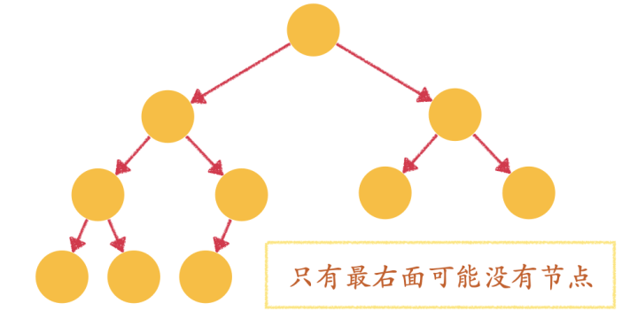

<WordTitle type='define'> 完全二叉树 </WordTitle>

在完全二叉树中，除了最底层节点可能没填满外，其余每层节点数都达到最大值，并且最下面一层的节点都集中在该层最左边的若干位置。若最底层为第 h 层，则该层包含 1~ 2h 个节点。


<WordTitle type='define'> 二叉搜索树 </WordTitle>

**二叉搜索树**是一棵有序树，简单来说就是**左节点小，右节点大**。具体来说，树里的数值满足：

- 若它的左子树不空，则左子树上所有结点的值均小于它的根结点的值；
- 若它的右子树不空，则右子树上所有结点的值均大于它的根结点的值；
- 它的左、右子树也分别为二叉排序树。

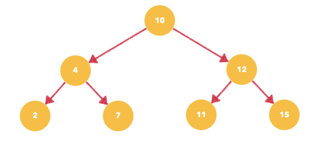

### 遍历模板

**树的遍历**有两种基本形式，以及四种延伸形式：

- **深度优先遍历 DFS**先一直深入，到子节点再往回走。
    - **前序遍历**节点 - 左 - 右
    - **中序遍历**左 - 节点 - 右
    - **后序遍历**左 - 右 - 节点


- **广度优先遍历 BFS**一层一层遍历。
    - **层序遍历**

其中常见的**前序遍历**、**中序遍历**以及**后序遍历**，区别就是在**什么时候做节点数据的处理**。三种遍历方法都要掌握递归和迭代两种写法。


#### 递归 DFS 模板
这三种遍历算法的**递归**方式都源于**DFS**，所以在此可以先给一个统一的模板。

```javascript
const dfs = (root)=>{
	if( 满足特定条件 ){ 返回操作 }
  // 前序在这操作
  dfs(root.left);
  // 中序在这操作
  dfs(root.right);
  // 后序在这操作
}
```

#### [「前序遍历」模板](https://leetcode-cn.com/problems/binary-tree-preorder-traversal/)

**前序遍历**是先处理节点数据，然后再遍历左右子树。

**递归版本**
```javascript
var preorderTraversal = function(root) {
    const res = [];
    const preorder = (node)=>{
        if( !node ) return;
        res.push(node.val);
        preorder(node.left);
        preorder(node.right);
    }
    preorder(root);
    return res;
};
```

**迭代版本**
```javascript
var preorderTraversal = (root) => {
  const res = [], stack = [];
	let node = root;
  while (stack.length || node ) {
    while( node ){
    	res.push(node.val);
      stack.push(node);
      node = node.left;
    }
    node = stack.pop();
    node = node.right
  }
  return res;
};
```

####  [「中序遍历」模板](https://leetcode-cn.com/problems/binary-tree-inorder-traversal/)

**中序遍历**先处理左子树，然后处理节点数据，最后处理右子树。

**递归版本**
```javascript
var inorderTraversal = function(root) {
    const res = [];
    const inorder = (node)=>{
        if( !node ) return;
        inorder(node.left);
      	res.push(node.val);
        inorder(node.right);
    }
    inorder(root);
    return res;
};
```

**迭代版本**
```javascript
var inorderTraversal = (root) => {
  const res = [], stack = [];
  let node = root;

  while (stack.length || node ) {
    if( node ){
    	stack.push(node);
      node = node.left;
    }else{
      node = stack.pop();
    	res.push(node.val);
      node = node.right;
    }
  }
  return res;
};
```

#### [「后序遍历」模板](https://leetcode-cn.com/problems/binary-tree-postorder-traversal/)

**后序遍历**先处理左右子树，然后处理节点数据。不过后序遍历迭代版比较复杂，但是把它理解为倒叙的翻转版，就会很顺利得到解法。

**递归版本**
```javascript
var postorderTraversal = function(root) {
    const res = [];
    const postorder = (node)=>{
        if( !node ) return;
        postorder(node.left);
        postorder(node.right);
      	res.push(node.val);
    }
    postorder(root);
    return res;
};
```

**迭代版本**
```javascript
var postorderTraversal = (root) => {
  const res = [], stack = [];
  let node = root;

  while (stack.length || node ) {
    if( node.left ){
    	stack.push(node);
      node = node.left;
    }else if( node.right ){
    	stack.push(node);
      node = node.right;
    }else{
      res.push(node.val);
      node = stack.pop();
      // 只可能存在于边界
      if (node && node.left) node.left = null
      else if (node && node.right) node.right = null
    }
  }
  return res;
};
// 迭代版（倒叙）
var postorderTraversal = (root) => {
  let res = [], stack = []
  while (root || stack.length) {
    res.unshift(root.val)
    if (root.left) stack.push(root.left)
    if (root.right) stack.push(root.right)
    root = stack.pop()
  }
  return res;
};
```

#### [「层序遍历」模板](https://leetcode-cn.com/problems/binary-tree-level-order-traversal/)

**层序遍历**一般借助【队列】，一层层入，一层层出，基本代码如下：

```javascript
var levelOrder = function(root) {
    const queue = [] , res = [];
    if( root ) queue.push(root);
    while( queue.length ){
        res.push([]);
        let k = queue.length;
        while( k-->0 ){
            const node = queue.shift();
            res[res.length-1].push(node.val);
            if(node.left) queue.push(node.left);
            if(node.right) queue.push(node.right);
        }
    }
    return res;
};
```

### 前序遍历题目

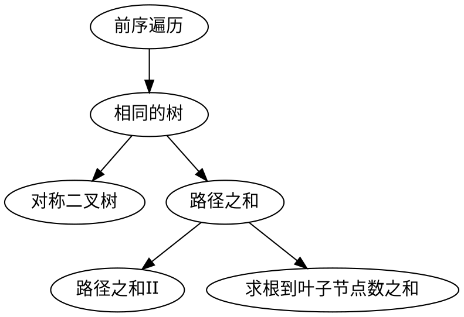

#### 1 [相同的树](https://leetcode-cn.com/problems/same-tree/)

<BlueTitle>概述</BlueTitle>

前序遍历

<BlueTitle>描述</BlueTitle>

给定两个二叉树，编写一个函数来检验它们是否相同。如果两个树在结构上相同，并且节点具有相同的值，则认为它们是相同的。

<BlueTitle>分析</BlueTitle>

只有父节点相同，两棵树才可能相同，所以使用**前序遍历**先判断父节点。

<TreeExplain
    bounding={
        [
            '左右树 l 和 r 同时不存在，判定为相同',
            '左右树 l 和 r 仅有一个存在，判定为不同'
        ]
    }
    order='pre'
    nodeList={
        [
            '两个节点值是否相同，不同的话直接退出',
            '对比l.left、r.left',
            '对比l.right、r.right'
        ]}
/>

```javascript
var isSameTree = function(l, r) {
    if( !l && !r ) return true;
    if( !l || !r ) return false;
    return l.val === r.val && isSameTree(l.left,r.left) && isSameTree(l.right,r.right);
};
```

#### 2 [对称二叉树](https://leetcode-cn.com/problems/symmetric-tree/)

<BlueTitle>概述</BlueTitle>

前序遍历

<BlueTitle>描述</BlueTitle>

给定一个二叉树，检查它是否是镜像对称的。

<BlueTitle>分析</BlueTitle>

核心在于对**镜像**的理解，即根节点相同，左右子树对称。也就是最左对最右，次左对次右，以此类推。

<TreeExplain
    bounding={
        [
            '左右树 l 和 r 同时不存在，判定为相同',
            '左右树 l 和 r 仅有一个存在，判定为不同'
        ]
    }
    order='pre'
    nodeList={
        [
            '两个节点值是否相同，不同的话直接退出',
            '对比l.left、r.right',
            '对比l.right、r.left'
        ]}
/>

```javascript
var isSymmetric = function(root) {
    const isSym = (l,r)=>{
        if( !l && !r ) return true;
        if( !l || !r ) return false;
        return l.val === r.val && isSym(l.left,r.right) && isSym(l.right,r.left);
    }
    return isSym(root,root);
};
```

#### 3 [路径总和](https://leetcode-cn.com/problems/path-sum/)

<BlueTitle>概述</BlueTitle>

前序遍历

<BlueTitle>描述</BlueTitle>

给定两个二叉树，编写一个函数来检验它们是否相同。如果两个树在结构上相同，并且节点具有相同的值，则认为它们是相同的。

<BlueTitle>分析</BlueTitle>

求和的顺序是从上到下，需要先加上根节点，再计算两子树路径和，所以使用**前序遍历**。

<TreeExplain
    bounding={
        [
            '左右树 l 和 r 同时不存在，说明到底部，判断路径和是否符合',
            '节点为空，说明它经历过【左右树 l 和 r 同时不存在】的判断，所以没有符合结果'
        ]
    }
    order='pre'
    nodeList={
        [
            '节点值是否等于sum',
            '判断 l 是否满足路径和 sum-root.val',
            '判断 r 是否满足路径和 sum-root.val'
        ]}
/>

```javascript
var hasPathSum = function(root, sum) {
    if( !root ) return false;
    if( !root.right && !root.left) return sum === root.val;
    return hasPathSum(root.left,sum-root.val) || hasPathSum(root.right,sum-root.val);
};
```

#### 4 [路径总和 II](https://leetcode-cn.com/problems/path-sum-ii/)

<BlueTitle>概述</BlueTitle>

前序遍历

<BlueTitle>描述</BlueTitle>

给定一个二叉树和一个目标和，找到所有从根节点到叶子节点路径总和等于给定目标和的路径。

<BlueTitle>分析</BlueTitle>

本题与【路径之和】一样，只是多了路径输出，也就是多个回溯算法。

<TreeExplain
    bounding={
        [
            '左右树 l 和 r 同时不存在，说明到底部，判断路径和是否符合',
            '节点为空，说明它经历过【左右树 l 和 r 同时不存在】的判断，所以没有符合结果'
        ]
    }
    order='pre'
    nodeList={
        [
            '节点值是否等于sum，如果满足压入路径',
            '判断 l 是否满足路径和 sum-root.val',
            '判断 r 是否满足路径和 sum-root.val'
        ]}
/>

```javascript
var pathSum = function(root, sum) {
    const res = [];

    const backtrack = (node,sum,path)=>{
        if( !node ) return;
        path.push(node.val)
        if(!node.left && !node.right) if( node.val === sum ) res.push([...path]);
        if(node.left) backtrack(node.left,sum-node.val,path);
        if(node.right) backtrack(node.right,sum-node.val,path);
        path.pop();
    }

    backtrack(root,sum,[]);
    return res;
};
```

#### 5 [求根到叶子节点数字之和](https://leetcode-cn.com/problems/sum-root-to-leaf-numbers/)

<BlueTitle>概述</BlueTitle>

前序遍历

<BlueTitle>描述</BlueTitle>

给定一个二叉树，它的每个结点都存放一个`0-9`的数字，每条从根到叶子节点的路径都代表一个数字。
例如，从根到叶子节点路径 1->2->3 代表数字 123。计算从根到叶子节点生成的所有数字之和。

<BlueTitle>分析</BlueTitle>

本题本质与【路径之和】一样，只是常规求和加上十进制权重，即 `sum * 10 + node.val` 。也就是说第 `1` 层的数乘以 `10^0` , 第 `2` 层的数乘以 `10^1` , 第 `3` 层的数乘以 `10^2` 。

最后返回的是左中右三值之和。

<TreeExplain
    bounding={
        [
            '左右树 l 和 r 同时不存在，说明到底部，返回求和',
            '节点为空，说明它经历过【左右树 l 和 r 同时不存在】的判断，所以没有符合结果'
        ]
    }
    order='pre'
    nodeList={
        [
            '节点值乘以十进制权重，并加进 sum 中',
            '计算左子树数字之和',
            '计算右子树数字之和'
        ]}
/>

```javascript
var sumNumbers = function(root) {
    const dfs = (node,sum)=>{
        if(node===null) return 0;
        sum = sum * 10 + node.val;
        if(!node.left&&!node.right) return sum;
        return dfs(node.left,sum) + dfs(node.right,sum);
    }
    return dfs(root,0);
};
```

### 中序遍历题目

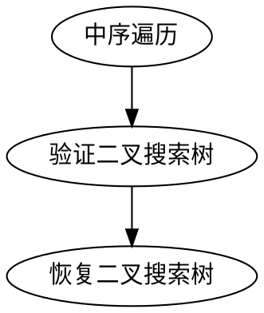

#### 1 [验证二叉搜索树](https://leetcode-cn.com/problems/validate-binary-search-tree/)

<BlueTitle>概述</BlueTitle>

中序遍历

<BlueTitle>描述</BlueTitle>

给定一个二叉树，判断其是否是一个有效的二叉搜索树。

<BlueTitle>分析</BlueTitle>

本题涉及**二叉搜索树**，该树的最大特色是**中序遍历**为递增数组。

<TreeExplain
    bounding={
        [
            '节点 root 不存在，说明已经经历种种判断，达到树的底端，返回 true'
        ]
    }
    order='in'
    nodeList={
        [
            '判断左子树 l 是否为二叉搜索树，只有返回 true 的时候，才继续操作',
            '判断当前节点是否大于前一个节点 pre ，如果是的话，说明当前中序遍历为递增，符合二叉搜索树的条件',
            '判断右子树 r 是否为二叉搜索树'
        ]}
/>

```javascript
var isValidBST = function(root) {
    let pre = Number.MIN_SAFE_INTEGER;
    const isValid = (root)=>{
        if( !root ) return true;
        if( !isValid(root.left)) return false;
        if( root.val <= pre ) return false;
        pre = root.val;
        return isValid(root.right)
    }
    return isValid(root);
};
```

#### 2 [恢复二叉搜索树](https://leetcode-cn.com/problems/recover-binary-search-tree/)

<BlueTitle>概述</BlueTitle>

中序遍历

<BlueTitle>描述</BlueTitle>

给你二叉搜索树的根节点 `root` ，该树中的两个节点被错误地交换。请在不改变其结构的情况下，恢复这棵树。

<BlueTitle>分析</BlueTitle>

本题涉及**二叉搜索树**，该树的最大特色是**中序遍历**为递增数组。题目要求找到两个**错位点**，所以用**中序遍历**过一遍树，将两个跳脱的节点找到，最后交换即可。

<TreeExplain
    bounding={
        [
            '节点 root 不存在，说明已经经历种种判断'
        ]
    }
    order='in'
    nodeList={
        [
            '判断左子树 l 是否为二叉搜索树，只有返回 true 的时候，才继续操作',
            '判断当前节点是否大于前一个节点 pre ，如果是的话，说明当前中序遍历为递增，符合二叉搜索树的条件',
            '判断右子树 r 是否为二叉搜索树'
        ]}
/>

```javascript
var isValidBST = function(root) {
    let pre = Number.MIN_SAFE_INTEGER;
    const isValid = (root)=>{
        if( !root ) return true;
        if( !isValid(root.left)) return false;
        if( root.val <= pre ) return false;
        pre = root.val;
        return isValid(root.right)
    }
    return isValid(root);
};
```

### 后序遍历题目

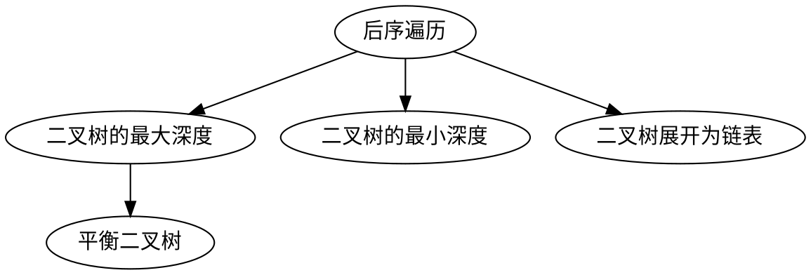

#### 1 [二叉树的最大深度](https://leetcode-cn.com/problems/maximum-depth-of-binary-tree/)

<BlueTitle>概述</BlueTitle>

后序遍历

<BlueTitle>描述</BlueTitle>

给定一个二叉树，找出其最大深度。二叉树的深度为根节点到最远叶子节点的最长路径上的节点数。

<BlueTitle>分析</BlueTitle>

当前节点高度需要先知道左右子树的高度才能计算，所以是**后序遍历**。

<TreeExplain
    bounding={
        [
            '节点 root 不存在，说明已经达到树的底端，高度为 0 '
        ]
    }
    order='post'
    nodeList={
        [
            '计算左子树 l 高度',
            '计算右子树 r 高度',
            'max (左子树高度 , 右子树高度 ) + 1'
        ]}
/>

```javascript
var maxDepth = function(root) {
    if(!root) return 0;
    else return Math.max( maxDepth(root.left), maxDepth(root.right)) + 1;
};
```

#### 2 [二叉树的最小深度](https://leetcode-cn.com/problems/minimum-depth-of-binary-tree/)

<BlueTitle>概述</BlueTitle>

后序遍历

<BlueTitle>描述</BlueTitle>

给定一个二叉树，找出其最小深度。最小深度是从根节点到最近叶子节点的最短路径上的节点数量。

<BlueTitle>分析</BlueTitle>

<TreeExplain
    bounding={
        [
            '节点 root 不存在，说明已经达到树的底端，高度为 0 '
        ]
    }
    order='post'
    nodeList={
        [
            '计算左子树 l 高度',
            '计算右子树 r 高度',
            [
                '如果两子树都有，深度就是左右子树深度最大值加一',
                '如果两子树只有一个，深度就是有的那个子树深度加一'
            ]
        ]}
/>

```javascript
var minDepth = function(root) {
    if(!root) return 0;
    if(!root.left&&!root.right) return 1;
    const l = minDepth(root.left) , r = minDepth(root.right);
    if( !root.right || !root.left ) return left + right + 1;
    return Math.min(left,right)+1;
};
```

#### 3 [平衡二叉树](https://leetcode-cn.com/problems/balanced-binary-tree/)

<BlueTitle>概述</BlueTitle>

后序遍历

<BlueTitle>描述</BlueTitle>

给定一个二叉树，判断它是否是高度平衡的二叉树。
本题中，一棵高度平衡二叉树定义为：

- 一个二叉树每个节点的左右两个子树的高度差的绝对值不超过 1


<BlueTitle>分析</BlueTitle>

本题本质是计算高度差，跟**二叉树的最大深度**一样是**后序遍历**。

<TreeExplain
    bounding={
        [
            '节点 root 不存在，说明已经达到树的底端，高度为 0 '
        ]
    }
    order='post'
    nodeList={
        [
            '计算左子树 l 高度',
            '计算右子树 r 高度',
            [
                '如果左右高度差有一是 -1 ，说明有大于高度差大于 1 的子树，所以结果也是 -1',
                '左右高度差的差大于 1 ，返回 -1',
                '返回最大高度差 + 1 '
            ]
        ]}
/>

```javascript
var isBalanced = function (root) {
    const height = (node)=>{
        if( !node ) return 0;
        const lH = height(node.left);
        const rH = height(node.right);

        if( lH === -1 || rH === -1 || Math.abs(rH-lH)>1) return -1;
        else return Math.max(rH,lH)+1;
    }
    return height(root)>=0;
};
```


#### 4 [二叉树展开为链表](https://leetcode-cn.com/problems/flatten-binary-tree-to-linked-list/)

<BlueTitle>概述</BlueTitle>

后序遍历

<BlueTitle>描述</BlueTitle>

给定一个二叉树，原地将它展开为一个单链表。

<BlueTitle>分析</BlueTitle>

本题重点考察递归思维，只关注一个节点怎么展开，然后推广全树。

<TreeExplain
    bounding={
        [
            '节点 root 不存在，说明已经达到树的底端，退出递归'
        ]
    }
    order='post'
    nodeList={
        [
            '展开左子树 l',
            '展开右子树 r',
            [
                '展开后的左子树放至节点右侧，左侧接空。',
                '展开后的右子树接在展开后的左子树最后的右节点',
            ]
        ]}
/>

```javascript
var flatten = function(root) {
    if( !root ) return ;

    flatten(root.left);
    flatten(root.right);

    const left = root.left , right = root.right;

    root.left = null;
    root.right = left;

    let p = root;
    while( p.right ) p = p.right;
    p.right = right;
};
```

### 层序遍历题目

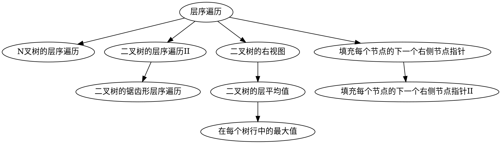

#### 1 [二叉树的层序遍历 II](https://leetcode-cn.com/problems/binary-tree-level-order-traversal-ii/)

<BlueTitle>概述</BlueTitle>

层序遍历

<BlueTitle>描述</BlueTitle>

给定一个二叉树，返回其节点值自底向上的层序遍历。 （即按从叶子节点所在层到根节点所在的层，逐层从左向右遍历）

<BlueTitle>分析</BlueTitle>

本题与普通层序遍历没有区别，只是输出路径的时候反着输出。

```javascript
var levelOrderBottom = function(root) {
    const queue = [] , res = [] ;
    if( root ) queue.push(root);
    while( queue.length ){
        res.unshift([]);
        let k = queue.length;
        while( k-- >0 ){
            const node = queue.shift();
            res[0].push(node.val);
            if(node.left) queue.push(node.left);
            if(node.right) queue.push(node.right);
        }
    }
    return res;
};
```

#### 2 [二叉树的右视图](https://leetcode-cn.com/problems/binary-tree-right-side-view/)

<BlueTitle>概述</BlueTitle>

层序遍历

<BlueTitle>描述</BlueTitle>

给定一棵二叉树，想象自己站在它的右侧，按照从顶部到底部的顺序，返回从右侧所能看到的节点值。

<BlueTitle>分析</BlueTitle>

本题与普通层序遍历区别不大，就是输出每一层的最后一个。

```javascript
var rightSideView = function(root) {
    const queue = [] , res = [];
    if( root ) queue.push(root);
    while(queue.length){
        let k = queue.length;
        while( k-- > 0){
            const node = queue.shift();
            if(k===0) res.push(node.val);
            if(node.left) queue.push(node.left);
            if(node.right) queue.push(node.right);
        }
    }
    return res;
};
```

#### 3 [二叉树的层平均值](https://leetcode-cn.com/problems/average-of-levels-in-binary-tree/)

<BlueTitle>概述</BlueTitle>

层序遍历

<BlueTitle>描述</BlueTitle>

给定一个二叉树，返回其节点值的锯齿形层序遍历。（即先从左往右，再从右往左进行下一层遍历，以此类推，层与层之间交替进行）。

<BlueTitle>分析</BlueTitle>

本题与普通层序遍历区别不大，就是输出每层的平均值。

```javascript
var averageOfLevels = function(root) {
    const queue = [] , res = [];
    if( root ) queue.push(root);
    while(queue.length){
        const len = queue.length;
        let k = len , sum = 0;
        while( k-- > 0){
            const node = queue.shift();
            sum += node.val;
            if(node.left) queue.push(node.left);
            if(node.right) queue.push(node.right);
        }
        res.push(sum/len);
    }
    return res;
};
```

#### 4 [在每个树行中找最大值](https://leetcode-cn.com/problems/find-largest-value-in-each-tree-row/)

<BlueTitle>概述</BlueTitle>

层序遍历

<BlueTitle>描述</BlueTitle>

给定一个二叉树，返回其节点值的锯齿形层序遍历。（即先从左往右，再从右往左进行下一层遍历，以此类推，层与层之间交替进行）。

<BlueTitle>分析</BlueTitle>

本题与普通层序遍历区别不大，就是输出每层的最大值。

```javascript
var largestValues = function(root) {
    const queue = [] , res = [];
    if( root ) queue.push(root);
    while(queue.length){
        let k = queue.length , max = Number.MIN_SAFE_INTEGER;
        while( k-- > 0){
            const node = queue.shift();
            max = Math.max(node.val,max);
            if(node.left) queue.push(node.left);
            if(node.right) queue.push(node.right);
        }
        res.push(max);
    }
    return res;
};
```

#### 5 [填充每个节点的下一个右侧节点指针](https://leetcode-cn.com/problems/populating-next-right-pointers-in-each-node/)

<BlueTitle>概述</BlueTitle>

层序遍历

<BlueTitle>描述</BlueTitle>

给定一个 完美二叉树 ，其所有叶子节点都在同一层，每个父节点都有两个子节点。填充它的每个 next 指针，让这个指针指向其下一个右侧节点。如果找不到下一个右侧节点，则将 next 指针设置为 NULL。

<BlueTitle>分析</BlueTitle>

本题使用层序遍历区，对每一层的元素进行连接，就层头尾操作略有区分。

```javascript
var connect = function(root) {
    const queue = [];
    if( root ) queue.push(root);
    while(queue.length){
        let k = queue.length - 1 ;
        let pre = queue.shift();
        if(pre.left) queue.push(pre.left);
        if(pre.right) queue.push(pre.right);
        while( k-- > 0){
            const node = queue.shift();
            pre = pre.next = node;
            if(node.left) queue.push(node.left);
            if(node.right) queue.push(node.right);
        }
        pre.next = null;
    }
    return root;
};
```

#### 6 [填充每个节点的下一个右侧节点指针 II](https://leetcode-cn.com/problems/populating-next-right-pointers-in-each-node-ii/)

<BlueTitle>概述</BlueTitle>

层序遍历

<BlueTitle>描述</BlueTitle>

给定一个二叉树，填充它的每个 next 指针，让这个指针指向其下一个右侧节点。如果找不到下一个右侧节点，则将 next 指针设置为 `NULL`。

<BlueTitle>分析</BlueTitle>

本题使用层序遍历区，如果从层序考虑，与**填充每个节点的下一个右侧节点指针**完全一致。

```javascript
var connect = function(root) {
    const queue = [];
    if( root ) queue.push(root);
    while(queue.length){
        let k = queue.length - 1 ;
        let pre = queue.shift();
        if(pre.left) queue.push(pre.left);
        if(pre.right) queue.push(pre.right);
        while( k-- > 0){
            const node = queue.shift();
            pre = pre.next = node;
            if(node.left) queue.push(node.left);
            if(node.right) queue.push(node.right);
        }
        pre.next = null;
    }
    return root;
};
```

#### 7 [二叉树的锯齿形层序遍历](https://leetcode-cn.com/problems/binary-tree-zigzag-level-order-traversal/)

<BlueTitle>概述</BlueTitle>

层序遍历

<BlueTitle>描述</BlueTitle>

给定一个二叉树，返回其节点值的锯齿形层序遍历。（即先从左往右，再从右往左进行下一层遍历，以此类推，层与层之间交替进行）。

<BlueTitle>分析</BlueTitle>

本题与普通层序遍历区别不大，就是路径输出的时候要判断奇偶，**奇数**放前面 **偶数**放后面。

```javascript
var zigzagLevelOrder = function(root) {
    const queue = [] , res = [];
    if( root ) queue.push(root);
    while(queue.length){
        res.push([]);
        let k = queue.length;
        while( k-- > 0){
            const node = queue.shift();
            if( res.length % 2) res[res.length-1].push(node.val);
            else res[res.length-1].unshift(node.val);
            if(node.left) queue.push(node.left);
            if(node.right) queue.push(node.right);
        }
    }
    return res;
};
```

#### 8 [N 叉树的层序遍历](https://leetcode-cn.com/problems/n-ary-tree-level-order-traversal/)

<BlueTitle>概述</BlueTitle>

层序遍历

<BlueTitle>描述</BlueTitle>

给定一个 N 叉树，返回其节点值的层序遍历。（即从左到右，逐层遍历）。

<BlueTitle>分析</BlueTitle>

本题与普通层序遍历区别不大，只是孩子多了需要遍历而已。

```javascript
var levelOrder = function(root) {
    const queue = [] , res = [];
    if( root ) queue.push(root);
    while(queue.length){
        res.push([]);
        let k = queue.length;
        while( k-- > 0){
            const node = queue.shift();
            res[res.length-1].push(node.val);
            for( let child of node.children ) queue.push(child);
        }
    }
    return res;
};
```

### 树的构建题目

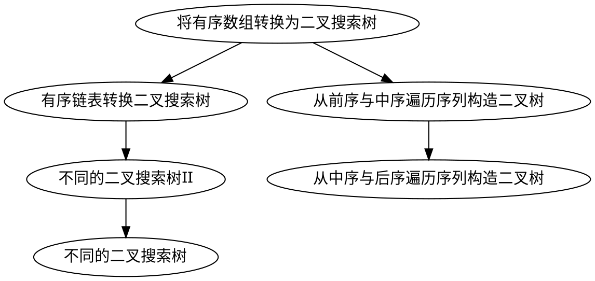

#### 1 [将有序数组转换为二叉搜索树](https://leetcode-cn.com/problems/convert-sorted-array-to-binary-search-tree/)

<BlueTitle>概述</BlueTitle>

树的构建

<BlueTitle>描述</BlueTitle>

将一个按照升序排列的有序数组，转换为一棵高度平衡二叉搜索树。

<BlueTitle>分析</BlueTitle>

本题涉及**二叉搜索树**，该树的最大特色是**中序遍历**为递增数组。只要保证**根节点**大于左侧，小于右侧即可。为了保证高度平衡，我们选择数组 `nums` 中点作为根节点。

<TreeExplain
    buildFun='build(l,r) 表示用 nums[l ... r] 构造的平衡二叉树'
    returnVal='root 。构造完成的平衡二叉树的根节点'
    bounding={
        [
            'l>r'
        ]
    }
    order='pre'
    nodeList={
        [
            '用中值构造，new TreeNode(nums[mid]) ',
            'build(l,mid-1)，即用 nums[l ... mid-1] 构造的平衡二叉树',
            'build(mid+1 , r)，即用nums[mid+1 ... r] 构造的平衡二叉树'
        ]}
/>

```javascript
var sortedArrayToBST = function(nums) {
    if(!nums.length) return null;
    const n = nums.length;
    const build = (l,r)=>{
        if(l>r) return null;
        const mid = l+r >>1;
        const root = new TreeNode(nums[mid]);
        root.left = build(l,mid-1);
        root.right = build(mid+1,r);
        return root;
    }
    return build(0,n-1);
};
```

#### 2 [有序链表转换二叉搜索树](https://leetcode-cn.com/problems/convert-sorted-list-to-binary-search-tree/)

<BlueTitle>概述</BlueTitle>

树的构建

<BlueTitle>描述</BlueTitle>

给定一个单链表，其中的元素按升序排序，将其转换为高度平衡的二叉搜索树。

<BlueTitle>分析</BlueTitle>

   - 本题涉及**二叉搜索树**，该树的最大特色是**中序遍历**为递增数组。
   - 本题与**将有序数组转换为二叉搜索树**类似，区别在于用的是**链表**。**链表**是递增的，所以我们用**中序遍历**依次创建即可。

<TreeExplain
    buildFun='build(l,r) 表示用 l ... r 构造的平衡二叉树'
    returnVal='root 。构造完成的平衡二叉树的根节点'
    bounding={
        [
            'l>r'
        ]
    }
    order='in'
    nodeList={
        [
            'build(l,mid-1)，即用 nums[l ... mid-1] 构造的平衡二叉树',
            '采用中序遍历，第一个创建的是最左边的节点，对应链表头节点',
            'build(mid+1 , r)，即用nums[mid+1 ... r] 构造的平衡二叉树'
        ]}
/>

```javascript
var sortedListToBST = function(head) {
    if(!head) return null;
    let len = 0 , p = head;
    while(p) len++ , p = p.next;

    const build = (l , r )=>{
        if(l>r) return null;
        const mid = l + r >> 1;
        const left = build(l,mid-1);
        const root = new TreeNode(head.val);
        head = head.next;
        root.left = left;
        root.right =  build(mid+1,r);
        return root;
    }
    return build(0,len-1);
};
```

#### 3 [不同的二叉搜索树 II](https://leetcode-cn.com/problems/unique-binary-search-trees-ii/)

<BlueTitle>概述</BlueTitle>

树的构建

<BlueTitle>描述</BlueTitle>

给定一个整数 n，求以 `1 ... n` 为节点组成的二叉搜索树有多少种？

<BlueTitle>分析</BlueTitle>

   - 本题涉及**二叉搜索树**，该树的最大特色是**中序遍历**为递增数组。
   - 只要保证**根节点**大于左侧，小于右侧即可。本题与**将有序数组转换为二叉搜索树**类似，区别在于选择不同的根节点，生成一个树的集合。

<TreeExplain
    buildFun='build(l,r) 表示用 l ... r 构造的平衡二叉树'
    returnVal='rootList ，构造完成的平衡二叉树的根节点的所有可能'
    bounding={
        [
            'l>r ，返回 [null] 表示不存在（为了之后的遍历）'
        ]
    }
    order='post'
    nodeList={
        [
            'build(l,i-1)，递归构建左子树，并拿到左子树所有可能的根结点列表leftRootList',
            'build(mid+1 , r)，递归构建右子树，并拿到右子树所有可能的根结点列表rightRootList',
            '从 1 ... n 遍历，分别创建 new TreeNode(i) '
        ]}
/>

#### 4 [不同的二叉搜索树](https://leetcode-cn.com/problems/unique-binary-search-trees/)

<BlueTitle>概述</BlueTitle>

树的构建

<BlueTitle>描述</BlueTitle>

给定一个整数 n，求以 `1 ... n` 为节点组成的二叉搜索树有多少种？

<BlueTitle>分析</BlueTitle>

   - 由于只用计算次数，所以本题属于**动态规划**，但是**不同的二叉搜索树II**接近，故放在一起。
   - 本题难点在于如何找**转移方程**，其他部分较为简单。

<BlueTitle title='转移方程'/>

- 以 `[1,2,3]` 为例子
    - `1` 为树根，左有 `f(0)` 种情况 ，右有 `f(2)` 种情况，一共是 `f(0)*f(2)` 种情况。
    - `2` 为树根，左有 `f(1)` 种情况 ，右有 `f(1)` 种情况，一共是 `f(1)*f(1)` 种情况。
    - `3` 为树根，左有 `f(2)` 种情况 ，右有 `f(0)` 种情况，一共是 `f(2)*f(0)` 种情况。
    - 此时 `f(3) = f(2)f(0) + f(1)f(1) + f(0)f(2)`
- 同理，`f(n) = f(n-1)f(0) + f(n-2)f(1) ... ``f(0)f(n-1)` 。

```javascript
var numTrees = function(n) {
    const dp = new Array(n+1).fill(0);
    dp[0] = 1;
    for( let i = 1 ; i<=n ; i++){
        dp[i] = 0;
        for( let j = 1 ; j<=i ; j++){
            dp[i] += dp[j-1] * dp[i-j];
        }
    }
    return dp[n];
};
```

#### 5 [从前序与中序遍历序列构造二叉树](https://leetcode-cn.com/problems/construct-binary-tree-from-preorder-and-inorder-traversal/)

<BlueTitle>概述</BlueTitle>

树的构建

<BlueTitle>描述</BlueTitle>

根据一棵树的前序遍历与中序遍历构造二叉树。

<BlueTitle>分析</BlueTitle>

**前序遍历** ： **[根节点]**[左子树][右子树]

**中序遍历** ： [左子树]**[根节点]**[右子树]

顺序读取前序数组，定位每个子树的**根节点**。然后拿着**根节点**去中序数组确定左右子树的范围。

<TreeExplain
    buildFun='build(preorder,preStart,preEnd,inorder,inStart,inEnd) 表示用 preorder[preStart,preEnd] 和 inorder[inStart,inEnd] 构造的平衡二叉树'
    returnVal='root ，构造完成的二叉树的根节点'
    bounding={
        [
            'preStart > preEnd'
        ]
    }
    order='pre'
    nodeList={
        [
            'new TreeNode(preorder[preStart])',
            ['左子树长度为 len=index-inStart ，其中 index 为根节点在中序数组的位置。','build(preorder,preStart+1,preStart+len,inorder,inStart,index-1)，递归构建左子树，返回根节点'],
            'build(preorder,preStart+len+1,preEnd,inorder,index+1,inEnd)，递归构建右子树，返回根节点'
        ]}
/>

```javascript
const buildTree = (preorder, inorder) => {
    const build = (preorder,preStart,preEnd,inorder,inStart,inEnd)=>{
        if( preStart > preEnd ) return null;
        let rootVal = preorder[preStart];
        let index = 0;
        for( let i = 0 ; i <= inEnd ; i++ ){
            if( inorder[i] === rootVal ){
                index = i;
                break;
            }
        }
        const root = new TreeNode(rootVal) , len = index - inStart ;
        root.left = build(preorder,preStart+1, preStart + len,inorder,inStart,index-1);
        root.right = build(preorder,preStart + len + 1 , preEnd , inorder , index + 1 , inEnd);
        return root;
    }
    return build(preorder,0,preorder.length-1,inorder,0,inorder.length-1);
};
```

#### 6 [从中序与后序遍历序列构造二叉树](https://leetcode-cn.com/problems/construct-binary-tree-from-inorder-and-postorder-traversal/)

<BlueTitle>概述</BlueTitle>

树的构建

<BlueTitle>描述</BlueTitle>

根据一棵树的中序遍历与后序遍历构造二叉树。

<BlueTitle>分析</BlueTitle>

**后序遍历** ： [左子树][右子树]**[根节点]**

**中序遍历** ： [左子树]**[根节点]**[右子树]

倒序读取前序数组，定位每个子树的**[根节点]**。然后拿着**[根节点]**去中序数组确定左右子树的范围。

<TreeExplain
    buildFun='build(postorder,postStart,postEnd,inorder,inStart,inEnd) 表示用 postorder[postStart,postEnd] 和 inorder[inStart,inEnd] 构造的平衡二叉树。'
    returnVal='root ，构造完成的二叉树的根节点'
    bounding={
        [
            'preStart > preEnd'
        ]
    }
    order='pre'
    nodeList={
        [
            'new TreeNode(preorder[preStart])',
            ['左子树长度为 len=index-inStart ，其中 index 为根节点在中序数组的位置','build(preorder,postStart,postEnd-len-1,inorder,inStart,index-1)，递归构建左子树，返回根节点'],
            'build(preorder,postEnd-len,preEnd-1,inorder,index+1,inEnd)，递归构建右子树，返回根节点'
        ]}
/>

```javascript
var buildTree = function(inorder, postorder) {
    const build = (postorder,postStart,postEnd,inorder,inStart,inEnd) =>{
        if( postStart > postEnd ) return null;
        const rootVal = postorder[postEnd];
        let index = 0;
        for( let i = 0 ; i <= inEnd ; i++){
            if( inorder[i] === rootVal ) {
                index = i ;
                break;
            }
        }
        const root = new TreeNode(rootVal) , len = inEnd - index;
        root.left = build(postorder,postStart,postEnd-len-1,inorder,inStart,index-1);
        root.right = build(postorder,postEnd-len,postEnd-1,inorder,index+1,inEnd);
        return root;
    }
    return build(postorder,0,postorder.length-1,inorder,0,inorder.length-1);
};
```

<SectionTitle slug='Hash Table'>2</SectionTitle>

## 哈希表

---

上文所述，哈希表有三种类型，它们对应不同的应用场景，具体如下。
**map**可以把前两者全部代替，但是适合前两者的题型还是应该了解的，所以本篇将给出前两者的特色题，通用题都用 `map` 处理。

| **类型** | **优势** | **劣势** |
| --- | --- | --- |
| **数组** | 直接高效 | **大小受限制**，如果哈希值较少，且跨度较大，会造成空间的浪费。 |
| **set** | 自动去重 | 只能记录一个 `key` 值 |
| **map** | 万用 | 空间消耗较大 |


### 数组类型题目

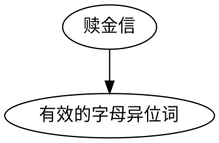

#### 1 [赎金信](https://leetcode-cn.com/problems/ransom-note/)

<BlueTitle>概述</BlueTitle>

哈希表 数组

<BlueTitle>描述</BlueTitle>

给定一个赎金信 (ransom) 字符串和一个杂志(magazine)字符串，判断第一个字符串 ransom 能不能由第二个字符串 magazines 里面的字符构成。如果可以构成，返回 true ；否则返回 false。

(题目说明：为了不暴露赎金信字迹，要从杂志上搜索各个需要的字母，组成单词来表达意思。杂志字符串中的每个字符只能在赎金信字符串中使用一次。)

<BlueTitle>示例</BlueTitle>

```text
canConstruct("a", "b") -> false
canConstruct("aa", "ab") -> false
canConstruct("aa", "aab") -> true
```

<BlueTitle>分析</BlueTitle>

<HashExplain
    type = 'num'
    target = 'search'
    targetValue = '已知 magazine ，判断 ransom 中元素是否都存在于 magazine'
    hashDesc = '本题最大的特征查找的是字母，因为一共就 26 个字母，所以可以使用数组作为哈希表'
    keyValue = '字母编号'
    valueValue = '出现次数'
/>

```javascript
var isAnagram = function(s, t) {
    const mono = new Array(26).fill(0);
    for( let c of s ) mono[c.charCodeAt()-'a'.charCodeAt()]++;
    for( let c of t ) mono[c.charCodeAt()-'a'.charCodeAt()]--;
    for( let count of mono ){
        if( count !== 0 ) return false;
    }
    return true;
};
```

#### 2 [有效的字母异位词](https://leetcode-cn.com/problems/valid-anagram/)

<BlueTitle>概述</BlueTitle>

哈希表 数组

<BlueTitle>描述</BlueTitle>

给定两个字符串 `s` 和 `t` ，编写一个函数来判断 `t` 是否是 `s` 的字母异位词。

<BlueTitle>示例</BlueTitle>

```text
输入: s = "anagram", t = "nagaram"
输出: true
```

<BlueTitle>分析</BlueTitle>

<HashExplain
    type = 'num'
    target = 'search'
    targetValue = '已知 s ，判断 t 中元素是否都存在于 s'
    hashDesc = '本题最大的特征查找的是字母，因为一共就 26 个字母，所以可以使用数组作为哈希表'
    keyValue = '字母编号'
    valueValue = '出现次数'
/>

```javascript
var isAnagram = function(s, t) {
    const mono = new Array(26).fill(0);
    for( let c of s ) mono[c.charCodeAt()-'a'.charCodeAt()]++;
    for( let c of t ) mono[c.charCodeAt()-'a'.charCodeAt()]--;
    for( let count of mono ){
        if( count !== 0 ) return false;
    }
    return true;
};
```

### 集合类型题目

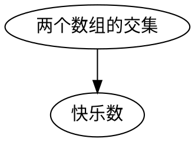

#### 1 [两个数组的交集](https://leetcode-cn.com/problems/intersection-of-two-arrays/)

<BlueTitle>概述</BlueTitle>

哈希表 集合

<BlueTitle>描述</BlueTitle>

给定两个数组，编写一个函数来计算它们的交集。

- 输出结果中的每个元素一定是唯一的。
- 我们可以不考虑输出结果的顺序。

<BlueTitle>示例</BlueTitle>

```text
输入：nums1 = [1,2,2,1], nums2 = [2,2]
输出：[2]
```

<BlueTitle>分析</BlueTitle>

<HashExplain
    type = 'set'
    target = 'search'
    targetValue = '已知 nums1 ，判断 nums2 中元素是否存在于 nums1 ，如果存在即为交集'
    hashDesc = '本题要求输出的交集元素唯一，且不看顺序，都在暗示使用集合处理'
    valueValue = '数组的数字'
/>

```javascript
var intersection = function(nums1, nums2) {
    const mono = new Set(nums1);
    const res = new Set();

    for( let num of nums2 ){
        if(mono.has(num)) res.add(num);
    }
    return Array.from(res)
};
```


#### 2 [快乐数](https://leetcode-cn.com/problems/happy-number/)

<BlueTitle>概述</BlueTitle>

哈希表 集合

<BlueTitle>描述</BlueTitle>

编写一个算法来判断一个数 `n` 是不是快乐数。

「快乐数」定义为：对于一个正整数，每一次将该数替换为它每个位置上的数字的平方和，然后重复这个过程直到这个数变为 1，也可能是 无限循环 但始终变不到 1。如果 可以变为 1，那么这个数就是快乐数。

如果 `n` 是快乐数就返回 `True` ；不是，则返回 `False` 。

<BlueTitle>示例</BlueTitle>

```
输入：19
输出：true
解释：
12 + 92 = 82
82 + 22 = 68
62 + 82 = 100
12 + 02 + 02 = 1
```

<BlueTitle>分析</BlueTitle>

<HashExplain
    type = 'set'
    target = 'search'
    targetValue = '判断当前求和 sum 是否出现过 ，如果出现过说明开始循环，只要不到循环，总有一天会到 1'
    hashDesc = '由于我们只需要存一个求和值，所以不用 map 如此麻烦，用 set 即可。需要熟悉取各位数值的操作，具体将会在数学相关那篇讲解'
    valueValue = '待快乐的数字'
/>

```javascript
var intersection = function(nums1, nums2) {
    const mono = new Set(nums1);
    const res = new Set();

    for( let num of nums2 ){
        if(mono.has(num)) res.add(num);
    }
    return Array.from(res)
};
```

### MAP类型题目

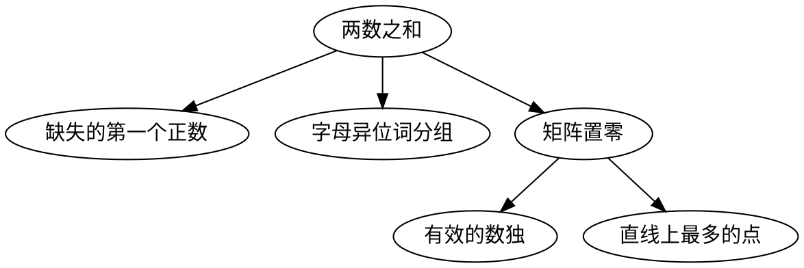

#### 1 [两数之和](https://leetcode-cn.com/problems/two-sum/)

<BlueTitle>概述</BlueTitle>

哈希表 map

<BlueTitle>描述</BlueTitle>

给定一个整数数组 `nums` 和一个整数目标值 `target`，请你在该数组中找出 和为目标值 的那两个整数，并返回它们的数组下标。

你可以假设每种输入只会对应一个答案。但是，数组中同一个元素不能使用两遍。

你可以按任意顺序返回答案。

<BlueTitle>示例</BlueTitle>

```
输入：nums = [2,7,11,15], target = 9
输出：[0,1]
解释：因为 nums[0] + nums[1] == 9 ，返回 [0, 1] 。
```

<BlueTitle>分析</BlueTitle>

<HashExplain
    type = 'map'
    target = 'search'
    targetValue = '已知 nums[i] ，查找 target-nums[i] 是否存在'
    hashDesc = '由于我们要记录两个值，索引下标和索引指向的数据，所以选择 map 实现'
    keyValue='数字'
    valueValue = '数字的下标'
/>

```javascript
var twoSum = function(nums, target) {
	const mono = new Map();
  for(let i = 0 ; i < nums.length ; i++){
  	const tmp = target - nums[i];
    if(mono.has(tmp)) return [mono.get(tmp),i];
    mono.set(nums[i],i)
  }
  return [];
};
```

#### 2 [缺失的第一个正数](https://leetcode-cn.com/problems/first-missing-positive/)

<BlueTitle>概述</BlueTitle>

哈希表 map

<BlueTitle>描述</BlueTitle>

给你一个未排序的整数数组，请你找出其中没有出现的最小的正整数。

<BlueTitle>分析</BlueTitle>

<HashExplain
    type = 'map'
    target = 'record'
    targetValue = '从 0 开始计数 i ，查找 i 是否存在于数组 nums'
    keyValue='数字'
    valueValue = '是否出现'
/>

```javascript
var firstMissingPositive = function(nums) {
    let res = 1;
    while(nums.includes(res)) res++;
    return res;
};
```

#### 3 [矩阵置零](https://leetcode-cn.com/problems/set-matrix-zeroes/)

<BlueTitle>概述</BlueTitle>

哈希表 map

<BlueTitle>描述</BlueTitle>

给定一个 m x n 的矩阵，如果一个元素为 0，则将其所在行和列的所有元素都设为 0。请使用原地算法。

<BlueTitle>分析</BlueTitle>

<HashExplain
    type = 'map'
    target = 'record'
    targetValue = '记录 0 出现的行或者列，之后统一置零'
    keyValue='行/列'
    valueValue = '是否出现'
/>

```javascript
var setZeroes = function(matrix) {
    const m = matrix.length , n = matrix[0].length;
    const col = [] , row = [];
    for( let i = 0 ; i < m ; i++){
        for( let j = 0 ; j < n ; j++){
            if(!matrix[i][j]) col.push(i),row.push(j);
        }
    }
    for( let i of col ) {
        for( let j = 0 ; j < n ; j++){
            if(matrix[i][j]) matrix[i][j] = 0;
        }
    }
    for( let i of row ) {
        for( let j = 0 ; j < m ; j++){
            if(matrix[j][i]) matrix[j][i] = 0;
        }
    }
    return matrix;
};
```

#### 4 [有效的数独](https://leetcode-cn.com/problems/valid-sudoku/)

<BlueTitle>概述</BlueTitle>

哈希表 map

<BlueTitle>描述</BlueTitle>

判断一个 9x9 的数独是否有效。只需要根据以下规则，验证已经填入的数字是否有效即可。

<BlueTitle>分析</BlueTitle>

<HashExplain
    type = 'map'
    target = 'record'
    targetValue = '查询数字是否在【同行】、【同列】以及【同框】出现过。'
    keyValue={['行+数字','列+数字','框+数字']}
    valueValue = {['是否出现','是否出现','是否出现']}
/>

```javascript
var isValidSudoku = function(board) {
    const row = {} , col = {} , box = {};

    for(let i = 0 ; i < 9 ; i++){
        for(let j = 0 ; j < 9 ; j++){
            if(board[i][j]!== '.'){
                const num = board[i][j] , boxIdx = Math.floor(i / 3) * 3 + Math.floor(j/3);
                if(row[`${i}-${num}`] || col[`${j}-${num}`] || box[`${boxIdx}-${num}`]) return false;
                row[`${i}-${num}`] = col[`${j}-${num}`] = box[`${boxIdx}-${num}`] = true;
            }
        }
    }
    return true;
};
```

#### 5 [直线上最多的点数](https://leetcode-cn.com/problems/max-points-on-a-line/)

<BlueTitle>概述</BlueTitle>

哈希表 map

<BlueTitle>描述</BlueTitle>

给定一个 m x n 的矩阵，如果一个元素为 0，则将其所在行和列的所有元素都设为 0。请使用原地算法。

<BlueTitle>分析</BlueTitle>

<HashExplain
    type = 'map'
    target = 'record'
    targetValue = '遍历每一个点与另一个点的所有斜率，并统计每个斜率经过的点'
    hashDesc = '注意特殊点，相同点直接跳过计数，不存在除余缩小处理'
    keyValue='斜率'
    valueValue = '经过的点'
/>

```javascript
var maxPoints = function(points) {
    const n = points.length
    if (n <= 2) return n
    let res = 2 ;
    for (let i = 0; i < n; i++) {
        let max = 0 , dup = 0;
        const map = new Map()
        for (let j = 0; j < n; j++) {
            if (i !== j) {
                if (isSame(points[i], points[j])) dup++;
                else {
                    const key = ((points[i][1] - points[j][1]) % 10000) / (points[i][0] - points[j][0])% 10000;
                    if (!map.has(key)) map.set(key, 2);
                    else map.set(key, map.get(key) + 1);
                }
            }
        }
        max = Math.max(max,...map.values())
        if (max) max += dup;
        else return n;
        res = Math.max(res, max)
    }
    return res;
};

const isSame = (p1, p2)=>(p1[0] === p2[0]) && (p1[1] === p2[1]);
```

#### 6 [字母异位词分组](https://leetcode-cn.com/problems/group-anagrams/)

<BlueTitle>概述</BlueTitle>

哈希表 map

<BlueTitle>描述</BlueTitle>

给定一个字符串数组，将字母异位词组合在一起。字母异位词指字母相同，但排列不同的字符串。

<BlueTitle>分析</BlueTitle>

<HashExplain
    type = 'map'
    target = 'record'
    targetValue = '对于同分异构体，排完序后是相同的，可以利用这一点，将同分异构体存在同一处点'
    keyValue='排序后的字符串'
    valueValue = '它的同分异构体数组'
/>

```javascript
var groupAnagrams = function(strs) {
    const map = new Map();
    for( let str of strs){
        const tmp = str.split('').sort().join('');
        if(map.has(tmp)) map.set(tmp,[...map.get(tmp),str]);
        else map.set(tmp,[str]);
    }
    return [...map.values()];
};
```

<ArticleEnding/>
