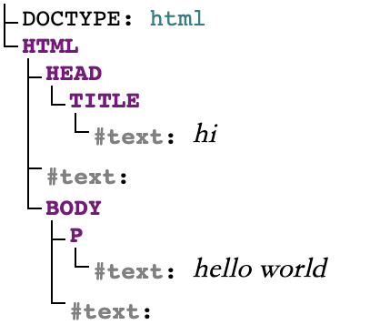
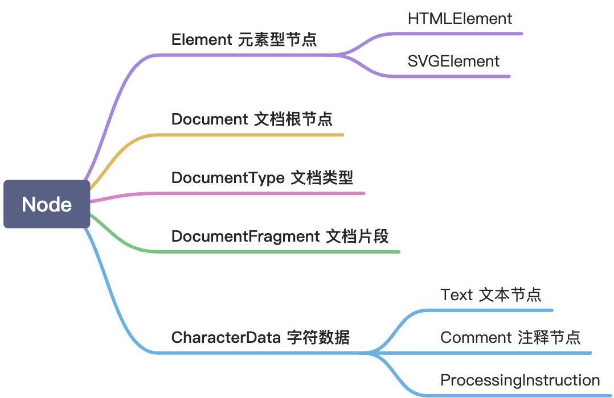

import {
    QuestionTitle,
    RegularTitle,
    WordTitle,
    ArticleEnding,
    SectionTitle
} from "../../components/CommonComponents";

import { Tag } from 'antd'

<SectionTitle slug='Overview'>0</SectionTitle>

## 概述

---

<WordTitle type='define'> DOM | Document object model </WordTitle>

DOM （Document object model）是文档对象模型，它从对象角度来描述文档（HTML/XML）。

| DOM API                | 描述                                 |
| ---------------------- | ------------------------------------ |
| Node                   | DOM树节点相关 API                      |
| Range                  | 操作文字范围相关 API                    |
| Traversal              | 遍历 DOM 需要的 API                    |

<SectionTitle slug='Node'>1</SectionTitle>

## 节点

---

每个 HTML 文档都可以被描述成节点树（ Node tree ），就以下面的 HTML 文档为例：

```html
<!DOCTYPE html>
<html>
 <head><title>hi</title></head>
 <body><p>hello world</p></body>
</html>
```

它可以被描述成：[前往该网址体验](https://software.hixie.ch/utilities/js/live-dom-viewer/)



<RegularTitle type="note" title="回车会被认为是 Text Node"/>

DOM 为了访问处理 HTML 文档，规定了 Node 抽象接口对节点树进行描述。按照继承关系，节点的类型可以按照下图进行分类：



Node 接口中定义了 `nodeType` 和 `nodeName` 来指明节点类型：

| **Type** | **nodeType** | **nodeName** | **对应 HTML** |
| :--- | :--- | :--- | :--- |
| **Element** | 1 | 标签名 | `<tagName></tagName>` |
| **Text** | 3 | #text | `text` |
| **Comment** | 8 | #comment | `<!-- comment-->` |
| **Document** | 9 | #document | 默认生成 |
| **DocumentType** | 10 | html | `<!Doctype html>` |
| **DocumentFragment** | 11 | `#document-fragment` | 不参与 DOM 树 |

其中 `Element`，`Text`，`Document` 节点最为常用，以下会重点介绍。
`DocumentFragment` 与 `Document` 结构类似，但不会出现在 DOM 树中，只存在于内存中，所以修改 `DocumentFragment` 不会引起重绘和重排。常与 `Range` 配合，可实现高性能节点批量操作，详见 `Range` 一节。

### Object

---

#### 1.1.1 Interface Node

<RegularTitle type="show" title="想一想设计一个 Node 需要什么信息"/>

<QuestionTitle type='who'/>

Node 是对 node tree 上的元素的抽象描述，需要指明节点的基本类型和类型名
- **nodeType** : `unsigned short`
- **nodeName** : `DOMString`

<QuestionTitle type='where'/>

用于描述 Node 在节点树中的位置

<QuestionTitle type='ans'>我的父子关系</QuestionTitle>

- **parentNode** : ?`Node`
- **parentElement** : ?`Element`
- **childNodes** : ?`NodeList`
- **firstChild** : ?`Node`
- **lastChild** : ?`Node`

<QuestionTitle type='ans'>我的兄弟关系</QuestionTitle>

 - **previousSibling** : ?`Node`
 - **nextSibling** : ?`Node`

<QuestionTitle type='ans'>还有这些API</QuestionTitle>

- **isEqualNode**(otherNode: ?Node) : `boolean`
- **compareDocumentPosition**(other:Node) : `unsigned short`
    - `0x01` DISCONNECTED
    - `0x02` PRECEDING
    - `0x04` FOLLOWING
    - `0x08` CONTAINS
    - `0x10` CONTAINED_BY
- **contains**(other:?Node) : `boolean`

<QuestionTitle type='what'/>

由于每个 Node 只有一个父元素，主要提供子节点的更删改操作。

<QuestionTitle type='ans'>插入子元素</QuestionTitle>

- **insertBefore**(newNode : Node, child : ?Node) : Node
- **appendChild**(node : Node) : Node

<QuestionTitle type='ans'>删除 & 替换</QuestionTitle>

- **removeChild**(child : Node) : Node
- **replaceChild**(node : Node, child : Node) : Node **[ 等效于先删除再添加 ]**

<QuestionTitle type='ans'>拷贝元素</QuestionTitle>

- **cloneNode**(optional boolean deep = false) : Node

<RegularTitle type="note" title="如果 appendChild 插入的节点存在于 DOM 树中，会现将原来的节点删除，确保父节点的唯一性。"/>

<RegularTitle type="note" title="cloneNode 不会克隆点击事件。"/>

<br/>

#### 1.1.2 Interface Document

<RegularTitle type="show" title="想一想设计一个 Document 元素需要什么信息"/>

<Tag color='geekblue'> 继承 </Tag> node

通过 document.documentElement 获取。

<QuestionTitle type='who'/>

Document 一般涉及的就是 HTML 文档

- **contentType** : `DOMString` - `text/html`

<QuestionTitle type='ans'>Resource MetaData Management</QuestionTitle>

HTML5 增添了资源相关属性
- **location** ：`Location` （浏览器网址）
- **domain** : `USVString`
- **cookie** : `USVString`
- **lastModified** : `DOMString`

<QuestionTitle type='what'/>

<QuestionTitle type='ans'>创建元素</QuestionTitle>

`Document` 具有很高的权限，可以创建其他节点
- **createElement**( localName : DOMString ) : `Element`
- **createDocumentFragment**() : `DocumentFragment`
- **createComment**( data : DOMString ) : `Comment`
- **createTextNode**( data : DOMString ) : `Text`
- **createProcessingInstruction**( target : DOMString , data : DOMString) : `ProcessingInstruction`

<QuestionTitle type='ans'>查找 Element</QuestionTitle>

Document 根节点可连接 Element 节点，故提供查询方式。

- **getElementsByTagName**( qualifiedName : DOMString) : `HTMLCollection`
- **getElementsByClassName**( classNames : DOMString) : `HTMLCollection`

<QuestionTitle type='ans'>DOM Tree Accessors</QuestionTitle>

HTML5 将 Document 包含的标签都直接存进属性中。

- **body** : `HTMLElement`
- **head** : `HTMLHeadElement`
- **images** : `HTMLCollection`
- **embeds** : `HTMLCollection`
- **plugins** : `HTMLCollection`
- **links** : `HTMLCollection`
- **script** : `HTMLCollection`
- **getElementsByName**( classNames : DOMString ) : `NodeList`

<br/>

#### 1.1.3 Interface Element

<RegularTitle type="show" title="想一想设计一个元素需要什么信息"/>

<Tag color='geekblue'> 继承 </Tag> node

<QuestionTitle type='who'/>

Element 对应 HTML 的元素，所以现需要属性对其定义。

- **tagName** : `DOMString` （大写）
- **localName** : `DOMString` （小写）

<QuestionTitle type='ans'>还记录的属性 attr </QuestionTitle>

- **id** : DOMString
- **className** : DOMString

<QuestionTitle type='ans'>以及 attr 的 API </QuestionTitle>

- **setAttribute**(`DOMString` qualifiedName, `DOMString` value)
- **removeAttribute**(`DOMString` qualifiedName);
- **getAttribute**(`DOMString` qualifiedName) : ?`DOMString`
- **hasAttribute**(`DOMString` qualifiedName) : `boolean`

<QuestionTitle type='what'/>

<QuestionTitle type='ans'>查找我连接的节点</QuestionTitle>

Element 节点可连接 Element 节点，故提供查询方式

- **getElementsByTagName**(`DOMString` qualifiedName) : `HTMLCollection`
- **getElementsByClassName**(`DOMString` classNames) : `HTMLCollection`

<br/>

#### 1.1.4 Mixin

<RegularTitle type="show" title="我们从父子关系的角度审视下元素"/>

Mixin 主要是对 Element 操作进行拓展。 DOM 从以下两个角度对 API 进行拓展：

**父节点类型 ParentNode**

- **节点定义** 对**子元素**的增删改查操作
- **涉及节点** `Element` `Document` `DocumentFragment`

<br/>

**子节点类型 ChildNode**

- **节点定义** 对**兄弟元素**的增删改查操作
- **涉及节点** `Element` `DocumentType`

<br/>

<RegularTitle type="show" title="ParentNode 有什么特性"/>

父节点类型 ParentNode，主要添加对子元素的操作。

<Tag color='geekblue'> include </Tag> Element Document DocumentFragment

<QuestionTitle type='where'/>

- **children** : `HTMLCollection`
- **firstElementChild** : ?`Element`
- **lastElementChild** : ?`Element`
- **childElementCount** : `unsigned long`


<QuestionTitle type='what'/>

- **prepend**( ... nodes : `Node` | `DOMString` )
- **append**( ... nodes : `Node` | `DOMString` )
- **querySelector**( selectors : `DOMString` ) : ?`Element`
- **querySelectorAll**( selectors : `DOMString` ) : [NewObject] NodeList

<RegularTitle type="show" title="ParentNode 还有个延伸类型 NonElementParentNode"/>

为了避免在 Element 中暴露 getElementById() 而单独设置。

<Tag color='geekblue'> include </Tag> Document DocumentFragment

<QuestionTitle type='what'/>

- **getElementById**(`DOMString` elementId) : ?`Element`

<RegularTitle type="show" title="ChildNode 有什么特性"/>

<Tag color='geekblue'> include </Tag> Element DocumentType

<QuestionTitle type='what'/>

- **before**( ... nodes : `Node` | `DOMString` )
- **after**( ... nodes : `Node` | `DOMString` )
- **replaceWith**( ... nodes : `Node` | `DOMString` )
- **remove**();

<RegularTitle type="show" title="ChildNode 还有个延伸类型 NonDocumentTypeChildNode"/>

DocumentType 的兄弟就是 html 标签，不必单独设置。

<Tag color='geekblue'> include </Tag> Element

<QuestionTitle type='where'/>

- **previousElementSibling** : ?`Element`
- **nextElementSibling** : ?`Element`

### 2.1 HTMLElement

---

#### 2.1.1 Interface HTMLElement

<RegularTitle type="show" title="HTMLElement是HTNL元素的直接映射，需要怎么设置"/>

<Tag color='geekblue'> include </Tag> Element

<QuestionTitle type='who'/>

- **title** : DOMString
- **lang** : DOMString
- **dataset** : DOMStringMap （ HTML5 接收 data-xx 信息）

还有一些用户交互接口：

- **hidden** : boolean
- **draggable** : boolean
- **spellcheck** : boolean
- **innerText** : DOMString
- **click()**
- **forcus()**
- **blur()**

<RegularTitle type="show" title="其子类就讲 HTMLTableElement 一个"/>

`HTMLTableElement` 基本上是 `<table>` 属性的映射。

- rows : `HTMLCollection`
- tBodies : `HTMLCollection`
- createTHead() : `HTMLElement`
- deleteTHead()
- createTFoot() : `HTMLElement`
- deleteTFoot()
- createCaption() : `HTMLElement`
- deleteCaption()
- insertRow( index : `long` ) : `HTMLElement`
- deleteRow( index : `long` )

<br/>

### 3.1 Extensions

---

拓展主要来自 CSSOM 对定位和尺寸进行补充。

#### 3.1.2 Extensions to Document

<RegularTitle type="show" title="对 Document 的拓展"/>

**FROM  : **CSSOM

**SCROLL ：**拓展了滚动条相关的属性以及行为

 - **属性**
     - **scrollWidth** : `long`
     - **scrollHeight** : `long`
     - **scrollTop** : `double`
     - **scrollLeft** : `double`
 - **行为**
     - scroll(`unrestricted double` x, `unrestricted double` y);
     - scrollTo(`unrestricted double` x, `unrestricted double` y);
     - scrollBy(`unrestricted double` x, `unrestricted double` y);


#### 3.1.2 Extensions to Element

<RegularTitle type="show" title="对 Element 的拓展"/>

**FROM : **CSSOM

**SCROLL ：**拓展了滚动条相关的属性以及行为
 - **属性**
     - **scrollWidth** : `long`
     - **scrollHeight** : `long`
     - **scrollTop** : `double`
     - **scrollLeft** : `double`
 - **行为**
     - scroll(`unrestricted double` x, `unrestricted double` y);
     - scrollTo(`unrestricted double` x, `unrestricted double` y);
     - scrollBy(`unrestricted double` x, `unrestricted double` y);

<br/>

**CLIENT ：**拓展了对自身尺寸的属性。

 - **宽度 - 内容宽度 + padding**
 - **属性**
     - **clientWidth** : `long`
     - **clientHeight** : `long`
     - **clientTop** : `long` （边框宽度）
     - **clientLeft** : `long` （边框宽度）
 - **行为**
     - **getClientRects**() : `DOMRectList`
     - **getBoundingClientRect**() : `DOMRect [new object]`
         - **DOMRect.top / bottom** : 相对于可视区上部的距离
         - **DOMRect.left / right **: 相对于可视区左部的距离
         - **DOMRect.width / height **: 元素自身可视宽高** **

<RegularTitle type="note" title="getBoundingClientRect 是相对于浏览器可视区域（左，上）的距离"/>

#### 3.1.2.补 interface DOMRect

- **FROM  : **GEOMETRY
- **WHAT ：**规范了 DOM 矩形区域的尺寸属性
     - **x** : `double`
     - **y** : `double`
     - **width** : `double`
     - **height** : `double`
     - **top** : `double readOnly`
     - **right** : `double readOnly`
     - **bottom** : `double readOnly`
     - **left** : `double readOnly`


#### 3.1.3 Extensions to HTMLElement

**FROM  : **CSSOM
**OFFSET ：**拓展了**可视尺寸**相关属性
 - **宽度 - 内容宽度 + padding + border**
 - **自身**
     - **offSetWidth** : long
     - **offSetHeight** : long
 - **相对定位父元素**
     - **offsetParent** : Element
     - **offSetTop** : long
     - **offSetLeft** : long

<br/>

### API汇总

---

<RegularTitle type="note" title="以下无特殊声明就是通用API"/>

<QuestionTitle type='none'>Overview</QuestionTitle>

- Document 与 DocumentFragment 功能几乎一致，只是后者不能构建 DOM 树。
- 只有 querySelectorAll 查找返回的结果是一个拷贝，其他都是 Live 对象（实时更新）。

<QuestionTitle type='none'>Where</QuestionTitle>

**父子关系：**
- **parentNode** : ?`Node`
- **parentElement** : ?`Element`
- **childNodes** : ?`NodeList`
- **firstChild** : ?`Node`
- **lastChild** : ?`Node`

- **`Element` `Document` `DocumentFragment` 专属（ 有子元素的节点们 ）**
    - **children** : `HTMLCollection`
    - **firstElementChild** : ?`Element`
    - **lastElementChild** : ?`Element`

**兄弟关系：**
- **previousSibling** : ?Node
- **nextSibling** : ?Node

- **`Element` 专属（ 有兄弟元素的节点 ）**

    - **previousElementSibling** : ?`Element`
    - **nextElementSibling** : ?`Element`

<QuestionTitle type='none'>OPERATION - CREATE</QuestionTitle>

这是 `Document` 的特权。

- **createElement**( localName : `DOMString` ) : `Element`
- **createDocumentFragment**() : `DocumentFragment`
- **createComment**( data : `DOMString` ) : `Comment`
- **createTextNode**( data : `DOMString` ) : `Text`
- **createProcessingInstruction**( target : `DOMString` , data : `DOMString`) : `ProcessingInstruction`

<QuestionTitle type='none'>OPERATION - ADD</QuestionTitle>

- **insertBefore**(newNode : Node, child : ?Node) : Node
- **appendChild**(node : Node) : Node
- **`Element` `Document` `DocumentFragment` 专属（ 父节点们 ）**
    - **prepend**( ... nodes : Node | DOMString )
    - **append**( ... nodes : Node | DOMString )
- **`Element` `DocumentFragment` 专属（ 有多个子节点的父节点们 ）**
    - **before**( ... nodes : Node | DOMString )
    - **after**( ... nodes : Node | DOMString )

<QuestionTitle type='none'>OPERATION - DELETE & UPDATE</QuestionTitle>

- **removeChild**(child : Node) : Node
- **replaceChild**(node : Node, child : Node) : Node
- **`Element` `DocumentFragment` 专属（ 有多个子节点的父节点们 ）**
    - **remove**()
    - **replaceWith**( ... nodes : Node | DOMString )

<QuestionTitle type='none'>OPERATION - SEARCH</QuestionTitle>

- **`Element` `Document` `DocumentFragment` 专属（ 子节点可能有属性值 ）**
    - **getElementsByTagName**(DOMString qualifiedName) : HTMLCollection
-    **getElementsByClassName**(DOMString classNames) : HTMLCollection
- **`Element` `Document` `DocumentFragment` 专属（ 父节点们 ）**
    - **querySelector**( selectors : DOMString ) : ?Element
    - **querySelectorAll**( selectors : DOMString ) : [NewObject] NodeList
- **`Document` `DocumentFragment` 专属（ Document 及其替身 ）**
    - **getElementById**(DOMString elementId) : ?Element
    - **getElementsByName**( className : DOMString ) : NodeList
