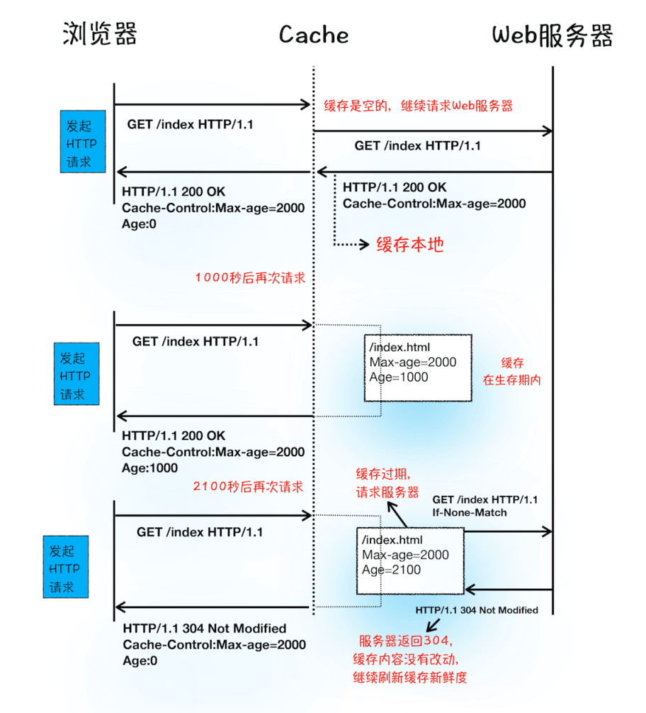
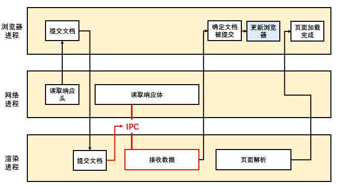

import {
    StepTitle,
    RegularTitle,
    WordTitle,
    ArticleEnding,
    SectionTitle
} from "../../components/CommonComponents";

<SectionTitle>1</SectionTitle>

## 先导知识

---

### CPU和GPU

CPU和GPU是计算机的核心部分，首先要了解这两个部分的作用。

<WordTitle type='define'> CPU | Central Processing Unit </WordTitle>

CPU（Central Processing Unit ）是计算机中的一种芯片，由多个核（Core）组成。每个核都可以看成一个高级打工人，他们可以做各种事情，而且核越多办的事情越快。

 

<WordTitle type='define'> GPU | Graphics Processing Unit </WordTitle>

GPU （Graphics Processing Unit ）的核就没有CPU强了，只能做一些简单的任务，但是胜在数量多，也就是并行能力极强。是针对于图像处理的组件。

 

### 进程和线程

<RegularTitle type="show" title="为什么要定义进程和线程 ？"/>

<WordTitle type='key'>时间颗粒大小不同</WordTitle>

这两个概念是用于**描述 CPU 或 GPU 执行应用时所需的概念，两者的区别在于时间颗粒大小的不同**。

- 首先，在 CPU 或 GPU 执行一个应用程序的时候，需要先将该应用程序所需的资源准备好，即在内存上分配一块该应用程序的私有空间，用于存储所需的数据和代码。

- 然后，在同一应用程序中，会有好多不同的逻辑线，它们共用一个私有空间，所以没必要再创建多个相同的空间去执行不同的逻辑线。这里采用的方法是，建立更时间精度更小的任务执行线去执行不同逻辑的任务。

**综上所述**，每个应用程序具有一个私有空间，运行多个逻辑线。为了更好描述执行的过程，我们建立进程和线程这两个概念：
- **应用程序命名为进程（Process），是资源分配的最小单位**。它会在程序启动时，创建一块内存，用来存放代码、运行中的数据以及执行任务的主线程。
- **内部的逻辑线命名为线程（thread），是CPU调度的最小单位**。

<RegularTitle type="show" title="如何更好的描述进程和线程的关系 ？"/>

**如果把进程看成火车，线程看做一节节车厢。**

| 进程现状                 | 类比                                 |
| ---------------------- | -----------------------------------------   |
| 线程在进程环境下        | 车厢单独行驶|
| 进程中可能有多个线程     | 火车有多节车厢                                 |
| 线程之间可以在进程中共享数据   | 车厢之间交流方便              |
| 进程之间的内容相互隔离          | 两辆火车不能直接交流              |
| 进程中任意一个线程执行出错，都会导致整个进程崩溃   | 一个车厢爆炸，火车没了              |
| 进程关闭后，操作系统会收回进程所占用的内  | 火车停了，各车厢都卸货              |

 

### TCP/IP协议

由互联网原理可知，互联网是一套理念和协议组成的体系架构。IP 和 TCP 协议分别属于网络层、传输层协议，他们负责让页面文件能顺利完整的传输至浏览器，但这其中到底发生了什么，便是本部分讨论的问题。

<RegularTitle type="show" title="假如我是个数据包，我该怎么达到目的地 ？"/>

#### 网络层 - IP 协议，确定我要去哪

<WordTitle type='define'> IP协议 | Internet Protocol </WordTitle>

IP协议（Internet Protocol），数据包在网络中传输需要遵守的协议。网络中每个设备都有唯一的地址，就像家庭收获地址一样，称之为**IP 地址**。一个要在网络中行使的数据包，会被加上 IP 头，表明其要从哪来，再到哪去。IP协议只负责将数据传送给指定 IP 地址。

#### 传输层 - UDP 协议，快速送达

<WordTitle type='define'> UDP 协议 | User Datagram Protocol </WordTitle>

UDP 协议（ User Datagram Protocol ），将数据包分发给指定应用程序需要遵守的协议。UDP 协议需要获取端口号来定位应用程序UDP 不能保证数据可靠性，但是传输速度却非常快，所以 UDP 会应用在一些关注速度、但不那么严格要求数据完整性的领域，如在线视频、互动游戏等。

#### 传输层 - TCP 协议，可靠送达

<WordTitle type='define'> TCP 协议 | Transmission Control Protocol </WordTitle>

TCP 协议（Transmission Control Protocol），是一种面向连接的、可靠的、基于字节流的传输层通信协议。

<RegularTitle type="flow" title="TCP的流程"/>

TCP 通过一个复杂的连接过程，确保数据可以可靠传输：

<StepTitle title='建立连接' index={1}/>

TCP 协议需要通过**三次握手**来建立客户端和浏览器的连接。三次握手分别是：
- **客 - 服** ：发送 SYN 表示要建立连接。
- **服 - 客** ：回复 SYN+ACK，表示服务器可以正常接收信号，并同意创建该连接。
- **客 - 服** ： 回复 ACK，表示客户端知道服务器可以接收信号，并要开始传输了。

<StepTitle title='传输数据' index={2}/>

接收端需要对每个数据包进行确认操作，即向发射端发送确认信息。如果发送端长时间没有收到确认信息，则认为数据丢失，启动重发机制

<StepTitle title='断开连接' index={3}/>

数据传输结束后，需要通过四次握手结束 TCP 连接:
- **客 - 服** ：发送 FIN 表示要断开连接。
- **服 - 客** ：回复 ACK 表示知道要断开，请等待服务器断开应用。
- **服 - 客** ：回复 FIN 和 ACK 表示服务器准备好断开连接。
- **客 - 服** ：回复ACK，知道双方准备好断开。

### HTTP协议

HTTP协议是建立在 TCP/IP 协议之上的应用层协议，主要用于**允许浏览器向服务器获取资源的协议**。

<RegularTitle type="show" title="HTTP是怎么让客户端和服务器通信的 ？"/>

**简单讲就是一组规范后的消息体系。**

**客户端**发送请求信息。
- **请求行**：消息简述，如`GET / HTTP/1.1`
  - `GET` 表示请求方法为获取资源。
  - `/` 表示要请求的资源。
  - `HTTP 1.1` 表示采用的HTTP协议版本。

- **请求头**：请求的各种具体信息。
  - 如文件类型，决定了是用来渲染界面还是下载。

- **请求体**：常用于 POST 请求，提供一些具体的信息。

**服务器**返回的响应信息。

- **响应行**：响应简述，如`HTTP/1.1 200 OK`
  - `HTTP 1.1` 表示采用的HTTP协议版本。
  - `200` 表示状态码。

- **响应头**：包括服务器自身的一些信息。

- **响应体**：客户端请求的实际内容。

## 浏览器架构

---

### 单进程浏览器时代

2007年之前，浏览器都是单进程的，即所有浏览器的模块都只是运行在同一进程中。

<RegularTitle type="show" title="根据进程线程的特点，单进程浏览器有什么风险 ？"/>

**不稳定**
- 一个模块的崩溃导致整个浏览器的崩溃，尤其是在使用插件的情况下。

**不流畅**
- 所有模块都运行在一个线程中，如果有一个模块过于耗时，会导致整体的缓慢。
- 另外，如果一个模块存在内存泄露的情况，由于过程中不会出现进程关闭的情况，内存不会彻底回收，导致泄露会持续积累。（对应特性3）

**不安全**
- 由于在进程中的线程可以共享数据，当使用插件的时候，恶意插件可以读取到浏览器中的数据，进而做出恶意操作。（对应特性2）

### 早期多进程浏览器时代

<RegularTitle type="show" title="那我们如何解决单进程浏览器的问题那 ？"/>

**将可能不安全、不流畅、不稳定的页面模块和插件模块，隔离到单独的进程中。**

**不稳定**
- 把最容易崩溃的插件和页面独立起来，要崩溃只是崩溃一个进程。

**不流畅**
- 把页面依次放进一个进程中，要耗时只影响当前的页面，要泄露这个个页面被关闭的时候就被全波回收。

**不安全**
- 限制了页面和插件的权限，只能通过IPC进行数据的访问。

<RegularTitle type="show" title="在早期多进程浏览器中，是怎么划分进程模块的 ？"/>

早期的多进程浏览器由**插件进程****渲染进程**以及**浏览器主进程**组成，各进程之间通过 IPC 进行通信。

**浏览器主进程**
- 将浏览器核心功能独立保护起来，负责下载资源，管理IPC等操作。

**插件进程**
- 相当于把最危险的插件隔离起来，让它只能通过 IPC （受限制的）方式进行通信。

**渲染进程**
- 一个页面对应一个渲染进程，负责代码的解析、渲染、JS代码的执行以及合成网页图片操作。

### 当下多进程浏览器时代

<RegularTitle type="show" title="随着业务的增多，多进程浏览器是不是也需要多加几个进程 ？"/>

当前的浏览器架构进行了拓展，**浏览器主进程**被拆分成**网络进程** **GPU进程**以及**浏览器主进程**，**插件进程**和**渲染进程**分别由多个进程。

**浏览器主进程**
- 负责界面显示、用户交互、子进程管理，同时提供存储功能。

**+ GPU进程**
- 专门进行耗时绘图操作。

**+ 网络进程**
- 处理网络资源加载。

**插件进程**
- HTML CSS JavaScript 转换为用户可以与之交互的网页。

**渲染进程**
- 跟页面一个待遇，单独小黑屋。

<RegularTitle type="show" title="当前的多进程浏览器架构的缺点是？"/>

可以看出，多进程浏览器解决以前的问题的方式，就是开出一堆独立的房间（进程），然后让线程各运行各的。这样导致一个很直接的结果就是**更高的资源占用**和**更复杂的体系架构**。

## 浏览器渲染流程

---

### 流程概览

<RegularTitle type="flow" title="在浏览器上，一个网络请求需要经历什么 ？"/>

我们以在浏览器地址栏键入 [https://www.baidu.com/](https://www.baidu.com/) 为例子。

<StepTitle title='构建请求' index={1}/>

构建请求行，表示我们想要什么资源。
- 如此时的请求行为 `GET / HTTP/1.1`
    - `GET` 表示请求方法为获取资源。
    - `/` 表示要请求的资源。
    - `HTTP 1.1` 表示采用的HTTP协议版本。

<StepTitle title='查找缓存' index={2}/>

每次请求可以选择让资源在本地备份，以便下次快速获取。
- 优势在于可以缓解服务器端压力，提升性能。（具体过程见后文）

<StepTitle title='准备 IP 地址和端口' index={3}/>

TCP/IP 协议所需要的资源。
- 不过我们输入的是域名，需要通过 DNS（Domain Name System） 将域名映射为 IP 地址。
- 浏览器也提供了 DNS 缓存技术，可以减少网络请求。
- HTTP协议默认端口 80。

<StepTitle title='等待 TCP 队列' index={4}/>

一个域名可以同时建立 6 个 TCP 连接（HTTP/1.1），如果多出6个时请等待。

<StepTitle title='建立 TCP 连接' index={5}/>

经过三次握手，客户端和服务器勾搭起来。

<StepTitle title='发送 HTTP 请求' index={6}/>

这时客户端告知服务器自己需要什么。
- 这时有个**重定向**问题，即浏览器请求的网址可能变更了，服务器会返回 301 状态码，告知浏览器需要重新用新的地址发送请求。

<StepTitle title='接收 HTTP 响应' index={7}/>

服务器将客户端需要的数据返回。

- 当客户端接收响应头后，会通知浏览器进程准备开始渲染，此时浏览器状态重置。
- 浏览器进程通知网络进程和渲染进程之间建立连接，将接收到的数据渲染在浏览器上。

<StepTitle title='断开TCP连接' index={8}/>

<RegularTitle type="summary" title="总体流程简图"/>

<RegularTitle type="show" title="缓存机制具体的运行流程是？"/>

**浏览器在构建请求后，会查看缓存是否为空。**

- **如果为空，就直接发送请求。**
    - 返回的响应通过字段 `Cache-Control` 设置缓存生命期。

- **如果不为空，继续检查缓存是否在生存期内：**
    - 如果在生存期内，直接调取缓存。
    - 如果不在生存期内，请求头加入 `if-None-Match` ，用于访问服务器资源是否更新过：
        - 如果相应状态码为`304 Not Modified` ，重置缓存生命值，并直接提取缓存。
        - 否则重新返回数据。

### 导航流程

导航流程是浏览器从 用户发出 URL 请求到页面开始解析的这个过程 的完整过程。其中涉及了浏览器进程、网络进程以及渲染进程。

<RegularTitle type="flow" title="在浏览器上，一个网络请求需要经历什么 ？"/>

<StepTitle title='用户输入+信息处理' index={1}/>

当用户在浏览器地址栏输入关键字时，会对数据进行处理。
- 如果是**搜索内容** ： 浏览器会结合默认搜索引擎，结合出新的 URL 。
- 如果是 **URL **: 浏览器会根据规则加上协议，合成完整的URL。
- **至此，浏览器进入“加载”状态**。

<StepTitle title='URL 请求阶段' index={2}/>

请求服务器网络资源。
- **开始导航**：【浏览器进程】通知【网络进程】开始对请求进行处理。
- **发起请求**：【网络进程】发起HTTP请求，具体流程见 HTTP 一节。
    - 通过响应头的 `Content-Type` 判断请求**数据类型**
    - 字节流 `application/octet-stream` 对应下载类型，请求会提交给下载管理器，导航流程结束。
    - HTML文件 `text/html` 则是直接进行渲染，继续导航流程。

<StepTitle title='准备渲染进程' index={3}/>

根据当前请求站点，判断是否分配新的渲染进程。

- **依据**：否是同一站点（根域名和协议相同）。
    - 如果是同一站点下，子页面将复用父页面的渲染进程。
    - 如果站点不同，创建新的进程。

<StepTitle title='提交文档' index={4}/>

该过程主要是【浏览器进程】开启【网络进程】和【渲染进程】的IPC，实现网络资源的获取。
- 当【浏览器进程】接收到【网络进程】的响应头数据之后，便向【渲染进程】发起“提交文档”的消息。
- 【渲染进程】接收到“提交文档”的消息后，会和【网络进程】建立传输数据的“IPC 管道”。
- 等文档数据传输完成之后，【渲染进程】会返回“确认提交”的消息给【浏览器进程】。
- 【浏览器进程】在收到“确认提交”的消息后，会更新浏览器界面状态，包括了安全状态、地址栏的 URL、前进后退的历史状态，并更新 Web 页面。

<StepTitle title='渲染阶段' index={5}/>

接收到数据后，变开始渲染页面（下一节详细说明）

### 渲染流程

渲染是浏览器很重要的一个环节，对优化页面卡顿问题、动画流程速度等问题都很有启示意义。

<RegularTitle type="flow" title="渲染都要经历什么流程？"/>

<RegularTitle type="note" title="渲染是一个不断持续的过程，以下操作都发生在一帧中，一帧即为一个图像。"/>

<StepTitle title='构建 DOM 树理' index={1}/>

将 HTML 文件转换为浏览器能理解的 DOM 树。（ 具体节点类型见 _DOM&BOM_ 一章）

HTML 代码通过 **HTML 解析器**（HTML Parser）转换为 DOM 结构，会经历以下步骤：
- 将接收的字节流转换为分词器 Token。
    - StartTag Token - 起始节点，会进入Token 栈内进行管理。
    - 文本 Token - 记录标签内部内容。
    - EndTag Token - 结束节点，用于弹出Token 栈。
- 根据 Token 生成 DOM 节点。
- 根绝前后关系，将 DOM 节点转换为 DOM 树。

<StepTitle title='样式计算' index={2}/>

将 CSS 文件内的样式对应上DOM数，表示为 ComputedStyle 。

<StepTitle title='将 CSS 文件整合为浏览器可以理解的 StyleSheets' index={'2.1'} type={1}/>

CSS的文件来源有：
- link 导入的外部 CSS 文件**需要重新发出网络请求**
- `<style>`标记内的 CSS
- 元素的 style 属性内嵌的 CSS

可以通过 `document.styleSheets` 进行查阅。

<StepTitle title='将样式表中的属性值标准化' index={'2.2'}  type={1}/>

**将样式表中的属性值标准化。**
以下的非数值，将转化为浏览器能理解的计算值。
- 表示倍数的 ： 2em -> `32px`
- 表示颜色的字符串 ： red -> `rgb(255,0,0)`
- 一些数值上的默认值：bold -> `700`

<StepTitle title='计算每个DOM节点的具体样式' index={'2-3'} type={1}/>

<StepTitle title='布局阶段' index={3}/>

**创建布局树，即只包括可见元素的 DOM 树。**

**计算布局，将每个元素的坐标位置确定。**

<StepTitle title='分层阶段' index={4}/>

为了减轻再渲染的压力，浏览器会对页面进行分层，最后输出图层树。

**【何时分层】**
- 具有层叠上下文属性的元素，会被提升为单独的一层。
 - 定位属性，如 `position : fixed`。
 - 指定 z 轴，如 `z-index : 2` 。
 - 滤镜元素，如 `filter:blue(5px)`。
 - 透明属性，如 `opacity:0.5` 。

- 需要剪裁（clip）的地方也会被创建为图层。（简单理解为需要滚动）

**【为何要分层】**
- 如果整个页面都不分层，想要改变其中的一个元素，需要重新渲染整个页面，消耗过大。
- 如果页面分了层，像平移、旋转等操作，只需对分层整体操作即可，不需要任何重绘操作。

<StepTitle title='图层绘制' index={5}/>

根据图层树，将要绘制的内容拆成一个个绘制指令集合。（ 具体流程与 Canvas 绘制过程大体一致。 )

<StepTitle title='分块' index={'5-1'} type={1}/>

 由于视口尺寸有限，不能显示全部页面，线程会事先将页面分块。页面分成的块称之为图块（tile），大小一般为 256x256 或者 512x512 。

 <StepTitle title='栅格化' index={'5-2'} type={1}/>

将每个图块根据绘制指令送进 GPU 绘制成位图。

<WordTitle type='define'> 栅格化 </WordTitle>

栅格化是将图块转化为位图。

- 栅格化有单独的线程池，并会联系【GPU 进程】实现快速栅格化。
- 【GPU 进程】根据【渲染进程】提供的图块指令，生成位图，并存储在GPU内存中。

<StepTitle title='合成与显示' index={6}/>

 当所有图块都被栅格化后，合成线程会产生绘制图块的指令 “DrawQuad”，提交给【浏览器进程】。
【浏览器进程】中的 viz 组件用来接收该指令，并根据指令将页面绘制在内存中，最后将内存显示在屏幕上。

<ArticleEnding/>
