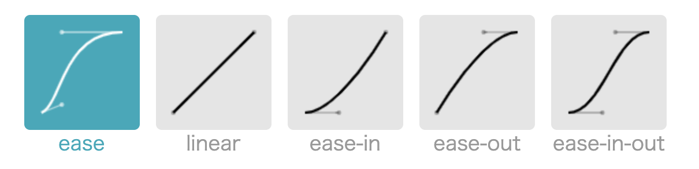
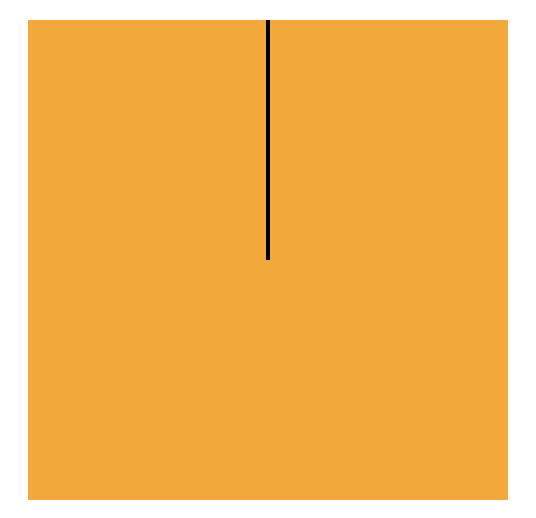

import {
    SelectContainer,
    RegularTitle,
    WordTitle,
    ArticleEnding,
    SectionTitle
} from "../../components/CommonComponents";

import SelectHoverExample from "./example/SelectHoverExample";

import SelectTransformExample from './example/SelectTransformExample'

import JumpBall from "./example/JumpBall";

import Clock from "./example/Clock";

<SectionTitle slug='Overview'>0</SectionTitle>

## 概述

---
<br/>


过渡(transition)和动画(animation)都可以实现动态效果，他们的区别如下表：

| Name                   | Key            | Difference                 |
| ----------------------| -------------  | -------------------------- |
| 过渡                   | transition      | 需要触发方式                |
| 动画                   | animation       | 可自动触发                  |

<SectionTitle slug='Transition'>1</SectionTitle>

## 过渡

---

<WordTitle type='define'>过渡 | Transitions</WordTitle>

过渡是CSS中的一个模块，它可以让你在特定的CSS属性值之间进行渐进式的过渡。

在了解过渡的具体操作之前，先大体了解下其基本属性：

| Properties            | Required       | Description                 |
| ----------------------| -------------  | -------------------------- |
| transition-property   | True           | 指定需要过渡的属性。          |
| transition-duration   | True           | 指定过渡的持续时间。（ s / ms）|
| transition-timing-function   | False   | 指定过渡的时序函数。           |
| transition-delay      | False          | 指定进入过渡的延时。（ s / ms） |

<RegularTitle type="note" title="以上属性可以简写为 transition ，唯一要求是间隔 duration 设置在延时 delay 的前面"/>

<br/>

<RegularTitle type="show" title="过渡的必须要设置的属性有什么？"/>

必须要设置的是`transition-property` 和 `transition-duration` 两个属性。

- **设置过渡属性 `transition-property` ：**
    - 多个属性，用逗号隔开，形如 `height` , `width` 就是同时变化两个属性。
    - 全部属性，用字符串 `all` 。
    - **注意**：属性的范围是所有可以计算的数值，像 `auto` 这种值不可使用。


- **设置持续时间 `transition-duration` ：**
    - 单位是 秒 s 或者 毫秒 ms ，两者差 10^3 倍。
    - 如果过渡的属性所用过渡时间不一致，也是用逗号隔开，只要一一对应即可。

<RegularTitle type="example" title="方块变大之术"/>

为了这里采用 `React` 组件的方式，展示了点击方块变大的过程。

如果不熟悉 `React` 语法，只需关注属性 `transitionProperty` 和 `transitionDuration` 即可，
两者对应了CSS属性中的`transition-property` 和 `transition-duration`。

`transition-property`指定了要过渡的样式属性，例子中设置的是 `height, width` 表示高和宽同时发生变化，如果我们只想变化高，那就写成`transitionProperty: 'height'`。
当然我们可以使用属性值 `all` 表示所有属性都可能变化，具体变化的是什么那？那就要看变化前后哪些值变了，比如我们把`afterStyle`中的`height: '100px'`去掉，说明只会变化宽度。

`transition-duration`则是指定了变化持续的事件，可以尝试修改 `transitionDuration:1s`，体验方块加速的感觉。

<br/>

```jsx live=true
    render(()=>{
        const [flag,setFlag] = React.useState(true);
        // 可以尝试修改 transition 属性，体验不同动画效果。
        const commonStyle = {
            background: '#595959',
            transitionProperty: 'height, width',
            transitionDuration: '2s'
        };
        // 分别对应点击前后的大小。
        const beforeStyle = {
            ...commonStyle,
            width: '50px',
            height: '50px'
        };

        const afterStyle = {
            ...commonStyle,
            width: '100px',
            height: '100px'
        };

        // 外层方块的样式。
        const outsideBox= {
            margin: '0 auto',
            width: '100px',
            height: '100px',
            background: '#d9d9d9'
        }

        return(
            <div style={outsideBox}>
                <div onClick={()=>setFlag(!flag)} style={flag?beforeStyle:afterStyle}/>
            </div>
        )
    });
```

当然过渡的属性可以设置多个，时间也可以。即如果我想让长宽变化持续时间不同，我们可以用逗号隔开给  `transition-duration` 设置两个时间，如下面代码：

```css
div{
    width: 100px;
    height: 100px;
    transition-property: height , width;
    transition-duration: 2s , 1s;
}
```

<RegularTitle type="show" title="还可以给过渡设置什么属性？"/>

过渡还可以通过设置时序函数，改变过渡的变化方式，`transition-timing-function` 提供了几种固定值：
- `ease` 慢速开局 - 加速 - 减速
- `linear` 匀速运动
- `ease-in` 加速运动
- `ease-out` 减速运动
- `ease-in-out` 先加速，再减速

其过渡曲线如下图所示：



可以选择下图的属性值，体验不同时序函数的效果

<SelectContainer
    propsList={['transition-timing-function: linear;','transition-timing-function: ease-in;','transition-timing-function: steps(6, end);','transition-timing-function: cubic-bezier(.29, 1.01, 1, -0.68);']}
>
    <SelectHoverExample
        beforeProps='height: 200px;width: 100px;transition-property: height;transition-duration: 2s;background: #061178;'
        afterProps='height: 50px;'
    />
</SelectContainer>


<SectionTitle slug='Animations'>2</SectionTitle>

## 动画

---

<WordTitle type='define'>动画 | Animations </WordTitle>

动画是CSS中的一个模块，它可以让你使用关键帧来设置CSS属性值随时间变化的动画效果。

动画的灵活性体现在关键帧的设置上，所以先从@keyframes定义开始了解。

<WordTitle type='define'>@keyframes</WordTitle>

@keyframes是CSS At-rule，它通过定义动画序列的关键帧的样式，控制CSS动画的中间步骤。

在关键帧中，可以通过设置一下值，来规定每一步执行的动作，形如：

| Value                 | Description                                 |
| ----------------------| -----------------------------------------   |
| from                  | 动画的开始状态                                 |
| to                    | 动画的结束状态                                 |
| x %                   | 可以设置百分比，控制对应阶段的动画。              |

当然，除了关键帧之外，动画还有很多基本属性用来控制最终的动画展示。

| Properties            | Required       | Description                 |
| ----------------------| -------------  | -------------------------- |
| animation-name        | True           | 指定需要生效的关键帧          |
| animation-duration    | True           | 指定动画的持续时间。（ s / ms）|
| animation-timing-function| False       | 指定动画的时序函数。          |
| animation-delay       | False          | 指定进入动画的延时。（ s / ms）|
| animation-iteration-count| False       | 指定动画的执行次数。          |
| animation-direction   | False          | 指定动画的执行方向。 normal / reverse / alte|
| animation-play-state  | False          | 指定动画的执行状态。开始/暂停  |
| animation-fill-mode    | False          | 指定动画的填充状态。          |

<RegularTitle type="note" title="以上属性可以简写为 animation ，唯一要求也是间隔 duration 设置在延时 delay 的前面"/>

<br/>

<RegularTitle type="show" title="动画的必须要设置的属性有什么？"/>

必须要设置的和过渡差不多，无非是`animation-name` 和 `animation-duration` 两个属性。唯一不同的就是关键帧的设置。

如前文所述，关键帧设置了动画执行的每一个步骤。最基本的是，设置开始状态 `from` 和 结束状态 `to` 的状态值。
下面代码就是一个关键帧， 它将完成高度由 `100px` 到 `300px` 的转变。


```css
@keyframes taller {
  to{
    height : 100px;
  }

  from{
    height : 300px;
  }
}
```

当然，也可以设置百分比来增加动画的过程。假如我们的动画有 2s ，初始状态的高度为 `100px` ，1s 的高度为 `300px` ，2s 的高度为 `100px` 。代码可以如下书写：

```css
@keyframes taller {
  to{
    height : 100px;
  }
  50%{
    height : 300px;
  }
  from{
    height : 100px;
  }
}
```

由于上述代码 `from` 和 `to` 属性值一致，我们可以用逗号将他们写在一起：

```css
@keyframes taller {
  to, from{
    height : 100px;
  }
  50%{
    height : 300px;
  }
}
```

<RegularTitle type="example" title="方块变大之术2"/>

本实例和‘方块变大之术2’中的例子一样，只是换成动画来实现而已，故只展示关键代码。会变化的 `div` 在此设置为`id='box'`。

```css
 @keyframes bigger {
    from{
        height: 50px;
        width: 50px;
    }
    to{
        height: 100px;
        width: 100px;
    }
}
#box{
    animation-name: bigger;
    animation-duration: 2s;
}
```

然后我们再拿出过渡的代码对比下，可以发现两者之间的区别：

1. 动画对中间过程有更多控制权。
2. 过渡需要事件触发。


```css
#box{
    width: 50px;
    height: 50px;
    transition-property: width,height;
    transition-duration: 2s;
}
#box：hover{
    width: 100px;
    height: 100px;
}
```

<RegularTitle type="show" title="还可以给动画设置什么属性？"/>

动画还开放了动画执行相关的属性：

**次数 `animation-iteration-count`**
- 设置动画的执行次数，可选的取值有数字和 `infinity` （无限次）。

**方向 `animation-direction`**
-  设置动画的执行方向，可选值有：
    - `normal` - 从 `from` 到 `to` 。
    - `reverse` - 从 `to` 到 `from` 。
    - `alternate` - 从 `from` 到 `to` ，再从 `to` 到 `from` 。
    - `alternate`-reverse - 从 `to` 到 `from` ，再从 `from` 到 `to` 。

**状态 `animation-play-state`**

- 设置动画的状态，可选值有：
    - `running` 运行
    - `paused` 暂停

**填充模式 `animation-fill-mode`**

-  设置动画的填充模式，可选值有：
    - `none` 默认值，回到原处。
    - `forwards` 动画结束完停到动画结束时（ `to` 的状态 ）。
    - `backwards` 动画延时时，元素就会处于开始状态（ `from` 的状态）。
    - `both` 结合 `forwards` 和 `backwards` 。

<RegularTitle type="example" title="弹跳小球"/>

在简述代码之前，先看一下本实例的效果 ( 点击开始/暂停 )

<JumpBall move/>

首先搭建 HTML 结构，其中包含一个 `id` 为 `content` 的块元素中有一个 `id` 为 `boll` 的块元素。其中 `ball` 就是我们的小球，会自动在 `content` 弹跳。

```html
<div id="content">
    <div id = "ball"></div>
</div>
```

为了更好地观察小球的弹跳过程，增加适当样式，并且将`content`下边界用黑线标出。

```css
#content{
    margin: 100px auto;
    width: 400px;
    height: 400px;
    border-bottom: #0C0C0C solid 2px;
    overflow: hidden;
}

#ball{
    width: 100px;
    height: 100px;
    border-radius: 50%;
    background: orange;
}
```

此时的样式效果为：

<JumpBall move={false}/>

<br/>

我们想要的效果是：小球加速落地，小球减速弹起，小球再次加速落地，最终停在地面上。此时需要的设置依次是：
- 小球加速落地：时序函数 `ease-in`
- 小球减速弹起：时序函数 `ease-out`
- 最终停在地面上：填充状态 `forwards`

```css
#ball{
    width: 100px;
    height: 100px;
    border-radius: 50%;
    background: orange;
    animation: ball-drop 1s forwards ease-in;
}

@keyframes ball-drop {
    from{
        margin-top: 0;
    }
    33%{
        margin-top: 300px;
        animation: ease-out;
    }
    66%{
        margin-top: 100px;
        animation: ease-in;
    }
    to{
        margin-top: 300px;
    }
}
```

<SectionTitle slug='Transforms'>3</SectionTitle>

## 变形

---

<WordTitle type='define'>变形 | Transforms </WordTitle>

动画是CSS中的一个模块，它定义了如何在二维或三维空间中进行转换。

<RegularTitle type="note" title="Transforms 只改变自己，不影响周围。且需要配合过渡或动画使用。"/>

变形可以进行的操作有平移(translate)、旋转(rotate)以及缩放(scale),可以通过以下例子自行感受。

<SelectContainer
    propsList={['transform: translate(30px, 70%);','transform: scale(2, 0.5);','transform: rotate(0.5turn);']}
>
    <SelectTransformExample
        beforeProps='height: 50px;width: 50px;transition-property: all;transition-duration: 1s;background: #061178;'
    />
</SelectContainer>

<br/>

以下是三种效果的具体属性，设置形式是：`transform: XXXXX`


| 平移                   | 相对于自己                                 |
| ----------------------| ----------------------------------------- |
| translateX()          | x轴方向平移                                 |
| translateY()          | y轴方向平移                                 |
| translateZ()          | z轴方向平移                                 |

<br/>

| 旋转                   | 相对于自己中心旋转                          |
| ----------------------| ----------------------------------------- |
| rotateX()             | x轴方向旋转                                 |
| rotateY()             | y轴方向旋转                                 |
| rotateZ()             | z轴方向旋转                                 |

<br/>

| 缩放                   | 相对于中心放大缩小                          |
| ----------------------| ----------------------------------------- |
| scaleX()              | x轴方向缩放                                 |
| scaleY()              | y轴方向缩放                                 |

<RegularTitle type="example" title="钟表"/>

在简述代码之前，先看一下本实例的效果，可以发现本实例涉及的元素有：**指针**、**指针容器**和**表盘**。

<Clock/>

本实例难点在于，元素的旋转是**相对于中心**的，不是**相对于端点**的，我们该如何让**指针**相对于端点旋转？

一种解决方案是：在**指针**外套一层**指针容器**，让**指针**的端点位于**指针容器**的中心，然后**指针容器**绕着自身中心旋转，进而实现**指针**绕着端点旋转。



所以我们的布局就是 时分秒 各有一个**容器**和**指针**，具体代码如下：

```html
<div id="clock">
    <div id = "sec-container">
        <div id="sec"></div>
    </div>
    <div id = "min-container">
        <div id="min"></div>
    </div>
    <div id = "hour-container">
        <div id="hour"></div>
    </div>
</div>
```

然后，我们添加具体样式，并用绝对布局让时分秒的**指针容器**在表盘居中。

```css
#clock{
    margin: 100px auto;
    width: 400px;
    height: 400px;
    border-radius: 50%;
    border: 10px solid black;
    position: relative;
}

#clock > div{
    position: absolute;
    top: 0;
    bottom: 0;
    left: 0;
    right: 0;
    margin: auto;
}
```

根据三个**指针**的长宽设置**指针**和**指针容器**的样式。

```css
#sec-container{
    width: 90%;
    height: 90%;
}

#min-container{
    width: 70%;
    height: 70%;
}
#hour-container{
    width: 50%;
    height: 50%;
}

#sec{
    width: 2px;
    height: 50%;
    background: red;
    margin: 0 auto;
}
#min{
    width: 4px;
    height: 50%;
    background: black;
    margin: 0 auto;
}
#hour{
    width: 6px;
    height: 50%;
    background: black;
    margin: 0 auto;
}
```

最后是设置动画效果，由于所有指针都是旋转一周，只是延时不同而已，所以我们可以用相同的关键帧处理。

```css
#sec-container{
    width: 90%;
    height: 90%;
    animation: 60s rot infinite steps(60);
}

#min-container{
    width: 70%;
    height: 70%;
    animation: 3600s rot infinite steps(60);
}
#hour-container{
    width: 50%;
    height: 50%;
    animation: 43200s rot infinite steps(12);
}
@keyframes rot {
    from{
        transform: rotateZ(0);
    }
    to{
        transform: rotateZ(180deg);
    }
}
```

<ArticleEnding/>
