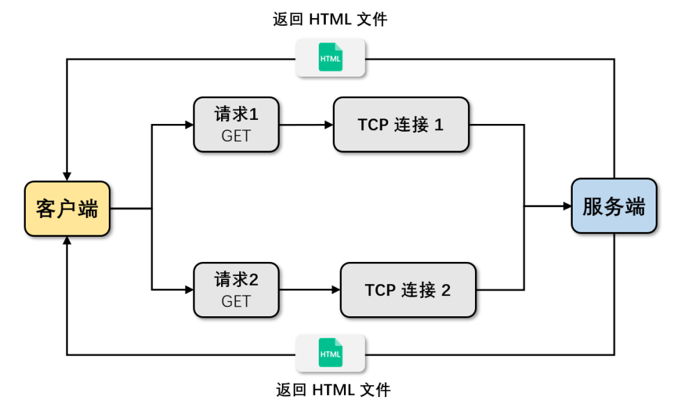

import {
    QuestionTitle,
    RegularTitle,
    WordTitle,
    ArticleEnding
} from "../../components/CommonComponents";

## HTTP/0.9

---

<WordTitle type='abstract'>简易</WordTitle>

HTTP/0.9 于 1991 年被提出，主要用于学术交流，只需要传递简单的 HTML 文档。

<RegularTitle type="show" title="为什么需要HTTP/0.9?"/>

<QuestionTitle>HTTP/0.9 要解决一个什么问题 ？</QuestionTitle>

**客户端如何从服务端获取简单的 HTML 格式数据。**
- 只需要客户端向服务端打个招呼（发请求），服务端收到请求后返回 HTML 文件即可。
- 返回的文档只有 HTML 格式，采用 ASCII 码较为合适。

<QuestionTitle>HTTP/0.9 是如何解决这个问题的 ？</QuestionTitle>

- 客户端只实现了 GET 请求。（只用请求行）
- 服务器只能返回 HTML 文本数据。（ASCII码）

<QuestionTitle>HTTP/0.9 的具体流程是什么样的？</QuestionTitle>

1. 根据 IP 地址、端口号和服务器建立 TCP 连接。
2. 发送 GET 的请求行信息，例如 GET /index.html。
3. 服务器接收到请求信息，读取对应 HTML 文件，以 ASCII 字符流返回给客户端。
4. HTML 文档传输完成，断开连接。


请求示意图如下：



<RegularTitle type="summary" title="总的来说，HTTP/0.9 因为面对的需求简单，所以实现也比较简单。"/>

- **请求方式**：只发送请求行，只能实现 GET 方法。
- **返回格式**：只有 HTML 文件，采用 ASCII 编码流。
- **TCP 连接**：一个请求创建一个连接，无法复用，无法维持。

## HTTP/1.0

---

<WordTitle type='abstract'>多类型文件传输</WordTitle>

1994年，出现了拨号上网服务，并且网景推出了浏览器，使得万维网不在限于学术交流，产生了许多新的需求，于是 HTTP/1.0 开始被研究。

<RegularTitle type="show" title="为什么要研究 HTTP/1.0 协议？"/>

<QuestionTitle>HTTP/1.0 要面对什么新的需求 ？</QuestionTitle>

**需要支持多类型文件下载。**
- 浏览器需要展示的文件不只是 HTML 文件，还有 CSS 、 JavaScript 、图片和音频等。
- 客户端需要告诉服务器，它要什么文件。

**以及随着文件增多所带来的性能优化问题。**

<QuestionTitle>HTTP/1.0 是如何支持多文件下载 ？</QuestionTitle>

**核心：引入信息头。**

- **加入文件类型字段。**客户端需要通知服务器需要什么类型的数据。
- **加入压缩方式字段。**需要通信的文件越来越大，需要进行压缩，此时服务器就要告诉客户端怎么压缩的。
- **加入语言字段。**万维网是针对全球的，客户端需要告诉服务器文件的语言。
- **加入编码方式字段。**不同文件的编码方式不同，客户端需要知道编码方式才能读取文件。

**此时的具体流程只是多加了请求头、响应头以及响应体（文件），其他流程基本没变。**


<QuestionTitle>HTTP/1.0 还有什么其他优化？</QuestionTitle>

- 服务器更好地回馈情况，引入**状态码**。
- 为缓解服务器压力，引入**Cache 机制**。
- 为统计客户端信息，引入**用户代理字段**。

<RegularTitle type="example" title="通过请求头理解 HTTP/1.0 多文件传输"/>

```http request
accept: text/html
accept-encoding: gzip, deflate, br
accept-Charset: ISO-8859-1,utf-8
accept-language: zh-CN,zh
```

- 第一行期望服务器返回 html 类型的文件。
- 第二行表示期望服务器可以采用 gzip、deflate 或者 br 其中的一种压缩方式。
- 第三行表示期望返回的文件编码是 UTF-8 或者 ISO-8859-1。
- 第四行是表示期望页面的优先语言是中文。

<RegularTitle type="summary" title="总的来说，HTTP/1.0 引入了信息头，使服务器和客户端可以更好交流。"/>

- **请求方式**：+支持GET、POST以及HEAD请求。
- **返回格式**：+各种各样，如HTML/JS/CSS/音频/视频。
- **TCP 连接**：一个请求创建一个连接，无法复用，无法维持。

## HTTP/1.1

---

<WordTitle type='abstract'>修补，持久化TCP</WordTitle>

随着技术的提升，HTTP/1.0 渐渐不能满足用户的需求，于是 HTTP/1.1 对 HTTP/1.0 进行了修补。

<RegularTitle type="show" title="为什么要研究 HTTP/1.1 协议？"/>

<QuestionTitle>HTTP/1.1 要解决 HTTP/1.0 的什么问题？</QuestionTitle>

- **随着请求增多，要不断建立 TCP 连接，在建立连接耗时较多。**HTTP/1.0 每次请求都会建立一个 TCP 连接，但随着每个页面引入的文件不断增多，比如一个页面有几百个图片，总不能建立几百个 TCP，重复几百次建立连接的耗时。

- **虚拟主机的发展，使得一个 IP 可以绑定多个域名。**HTTP/1.0 时期，IP 地址和域名是一对一绑定的，所以每个服务器只能有一个 域名，但随着虚拟主机的发展，一个 IP 地址可以对应多个域名，所以在请求时要增加字段，告知服务器执行的域名。

- **动态内容生成，导致页面大小事先不确定。**HTTP/1.0 时期，页面的大小是固定的，不会动态增加，但是时代变了，数据大小不固定了。

- HTTP **安全问题**也日渐提上日程。

<QuestionTitle>HTTP/1.1 该怎么解决上述问题？</QuestionTitle>

- **TCP 持久化连接。**
    - 与之不停开启多个 TCP 连接，不如让信息在一条 TCP 多传送几个。
    - HTTP/1.1 默认开启 TCP 的持久化连接，会让多个请求在同一条 TCP 上传输。可以通过 `Connection:close` 上设置，对于同一个域名，默认允许同时建立 6 个 TCP 持久连接。


- **HTTP 管线化（不成熟）。**
    - 但TCP 持久化会引起 队头阻塞 的问题，即多个请求都在同一条 TCP 上传输，如果有一个请求没有得到回复，整条 TCP 连接就会阻塞。（应用层）
    - HTTP/1.1试图通过管线化进行处理，多个 HTTP 请求不用排队发送，可以批量发送，但整体效果不佳。


- **增加Host头。**
    - 由于请求IP所指的服务器上可能有多个域名，所以要在请求头加入 Host 字段，来锁定请求的域名。
    - 通过配置 `Host` 的域名和端口号，即可支持多个 HTTP 服务：`Host: <domain>:<port>`


- **对动态生成内容的支持。**
    - 由于页面的内容可能会动态增加，HTTP/1.1 引入 Chunk transfer 机制，此时服务器会将数据分割成任意大小的数据块，每个数据块发送时会附上上个数据块的长度，最后使用一个零长度的块作为发送数据完成的标志。


- **Cookie 机制和安全机制**


<QuestionTitle>HTTP/1.1 还有什么其他优化？</QuestionTitle>

- 为更好处理各种请求，增加 PUT、PATCH、HEAD、 OPTIONS、DELETE 请求方法。
- 为缓解服务器压力，引入**Cache 机制**。
- 为统计客户端信息，引入**用户代理字段**。

<RegularTitle type="summary" title="总的来说，HTTP/1.1 在多方面对 HTTP/1.0 进行修补。"/>

- **请求方式**：支持GET、POST以及HEAD请求。+PUT、PATCH、 OPTIONS、DELETE请求方式。
- **返回格式**：各种各样，如HTML/JS/CSS/音频/视频，只是引用关系更为复杂。
- **TCP 连接**：+多条TCP可持续连接，但是面临队头阻塞的问题。

## HTTP/2

---

<WordTitle type='abstract'>多路复用</WordTitle>

HTTP/2 诞生于 2015 年，它的最大的特点是 All in 二进制，基于二进制的特性，对 HTTP 传输效率进行了深度优化。

<RegularTitle type="show" title="为什么要研究 HTTP/2.0 协议？"/>

<QuestionTitle>HTTP/2 要解决 HTTP/1.1 的什么问题？</QuestionTitle>

**【核心问题】带宽利用率低。**

- **TCP 的慢启动，传输数据初期较为费时。**
    - 当 TCP 建立连接后，会进入发送数据状态，刚开始发送速率很慢，随后渐渐达到理想速度。这是一个TCP 为了减少网络拥塞的一种策略。
    - HTTP/1.1 会维持多个TCP，但是有些文件较小，专门为这些文件经历一遍慢启动，确实没必要。


- **多 TCP 竞争同一带宽，但相互之间没有优先级。**
    - HTTP/1.1 会维持多个TCP，但是没有优先级的概念，会一同抢夺带宽。如果带宽都被图片、视频这种耗时资源抢走，那些关键资源能做的只有等待，造成页面渲染时间长。


- **在应用层仍存在队头阻塞。**
    - 虽然 HTTP/1.1 尝试管线化解决该问题，返回的时候还是按照顺序返回，仍存在问题。

<QuestionTitle>那HTTP/2 是怎么解决的？</QuestionTitle>

<WordTitle type='key'>一个域名只用一个 TCP 长连接，并通过二进制分帧层实现多路复用传输请求。</WordTitle>

- **多路复用机制在 TCP 和 HTTP 层直接加入二进制分帧层。**
    - 将每个消息分成多个二进制帧。
    - 每帧帧首有标识符，可以根据此重新将帧组合为数据。
    - 每帧标有优先级标识符，服务器可以根据此决定相应顺序。
    - 也就是将消息打散，快速将各个消息发送给服务器。（时分复用）


- **效果 1：**一路TCP就可以传输多个任务，也就不许用多个TCP连接。TCP 的慢启动 和 多 TCP 竞争 的问题便不复存在。


- **效果 2：**因为服务器能快速接受各个消息，所以可以选择先响应哪个，耗时请求可以延后处理，于是解决应用层的队头阻塞问题。（但是传输层仍存在，因为使用一条TCP）


<QuestionTitle>HTTP/2 还有啥其他特性？</QuestionTitle>

- **服务器推送。**
    - HTTP/2 允许服务器未经请求，主动向客户端发送资源，并缓存到客户端中，以避免二次请求。
    - 服务器可以主动将HTML文件所用的JavaScript 文件和 CSS 文件事先发给浏览器。


- **头部压缩至原来 20 %。**

<RegularTitle type="summary" title="总的来说，HTTP/2 已经是在TCP框架上的极致优化了。"/>

- **请求方式**：支持GET、POST、HEAD、PUT、PATCH、 OPTIONS、DELETE请求方式。
- **返回格式**：各种各样，如HTML/JS/CSS/音频/视频。
- **TCP 连接**：+单条TCP可持续连接，支持复用。

## HTTP/3

<WordTitle type='abstract'>QUIC</WordTitle>

HTTP/2 在 HTTP + TCP 的架构上已经优化到了极致，如果要想继续优化，那就只能从这个架构入手了。

<RegularTitle type="show" title="他来了，HTTP/3.0又要解决什么问题？"/>

<QuestionTitle>HTTP/3 要解决 HTTP/2 的什么问题？</QuestionTitle>

- **传输层的队头阻塞。**
    - 虽然 HTTP/2 使用多路复用机制解决了应用层的对头阻塞，但是使用的是一条 TCP ，就还会存在传输层的队头阻塞。
    - 传输层的队头阻塞是如果一个数据丢包了，会让整个 TCP 连接处于停滞状态，要么继续等待，要么重新传输。


- **TCP 建立连接的延时。**
  - **【指标】**连接延时是通过RTT（Round Trip Time）衡量的，即数据包往返时间。
    - 建立连接要三次握手，即1.5个RTT。
    - TLS 连接，TLS 有两个版本——TLS1.2 和 TLS1.3，每个版本建立连接所花的时间不同，大致是需要 1～2 个 RTT。
  - RTT受客户端和服务器的物理距离影响，距离较远时会比较缓慢。

- BUT 这两者都是 TCP 的问题，但是中间设备已经写死了这个协议，改不了。

<QuestionTitle>TCP 改不了，那怎么办？</QuestionTitle>

<WordTitle type='key'>封装另一个更基础的 UDP 协议，进化成 QUIC 协议。</WordTitle>

**QUIC = 多路 + 有序交付 + 快速握手 + 可靠性 + TLS。**

- **实现了类似 TCP 的流量控制、传输可靠性的功能。**虽然 UDP 不提供可靠性的传输，但 QUIC 在 UDP 的基础之上增加了一层来保证数据可靠性传输。


- **集成了 TLS 加密功能。**目前 QUIC 使用的是 TLS1.3，有较少的RTT 个数。


- **实现了 HTTP/2 中的多路复用功能（单独链路）。**和 TCP 不同，QUIC 实现了在同一物理连接上可以有多个独立的逻辑数据流。实现了数据流的单独传输，就解决了 TCP 中队头阻塞的问题。


- **实现了快速握手功能。**由于 QUIC 是基于 UDP 的，所以 QUIC 可以实现使用 0-RTT 或者 1-RTT 来建立连接。

<QuestionTitle>既然 HTTP/3 改好了，为什么不用那？</QuestionTitle>

- 浏览器支持少。


- UDP因为用的少，所以设备内优化不高，不足以支持 QUIC。

<ArticleEnding/>
